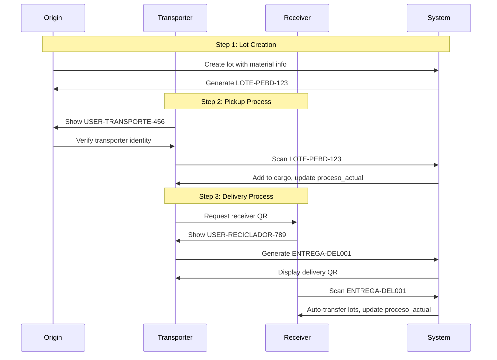

# CLAUDE.md

> This file provides comprehensive guidance to Claude Code (claude.ai/code) when working with code in this repository. Last updated: 2025-01-26

# BioWay México - Sistema de Trazabilidad de Reciclaje

## Project Overview

BioWay México is a production-ready Flutter mobile application that provides complete traceability for recyclable materials throughout the entire supply chain. The app supports two independent platforms (BioWay and ECOCE) through a multi-tenant Firebase architecture, with role-based access control and real-time tracking via QR codes.

### Production Status
- **ECOCE Platform**: ✅ Fully functional and tested
- **BioWay Platform**: ⏳ Configuration ready, Firebase project pending
- **Current Version**: 1.0.0+1
- **Active Branch**: funcionamiento_final

### Core Features
- **Unified Lot System**: Single immutable ID tracks materials through entire lifecycle
- **Multi-Tenant Architecture**: Independent Firebase projects for BioWay and ECOCE
- **Role-Based Access Control**: 7 distinct user types with specific workflows
- **Real-Time QR Tracking**: 4 types of QR codes for different operations
- **Bidirectional Transfer System**: Both sender and receiver must confirm transfers
- **Parallel Laboratory Process**: Sample taking without ownership transfer
- **Smart Weight Tracking**: Dynamic weight calculation based on current process
- **Document Management**: Automatic compression to 50KB for images, 5MB for PDFs
- **Offline-First Design**: Essential operations work without constant connectivity

## Commands

### Development
```bash
# Clean and get dependencies
flutter clean && flutter pub get

# Run on specific emulator
flutter run -d emulator-5554

# Run with verbose output
flutter run -v

# Run on all available devices
flutter run -d all
```

### Building
```bash
# Debug APK
flutter build apk --debug

# Release APK
flutter build apk --release

# App Bundle
flutter build appbundle

# iOS build
flutter build ios

# Obfuscated build
flutter build apk --obfuscate --split-debug-info=./symbols
```

### Testing
```bash
# Run all tests
flutter test

# Run with coverage
flutter test --coverage

# Run specific test
flutter test test/widget_test.dart

# Run tests by name
flutter test --name="Login"

# Integration tests
flutter drive --target=test_driver/app.dart
```

### Code Quality
```bash
# Analyze code
flutter analyze

# Format all files
dart format .

# Format specific file
dart format lib/main.dart

# Check outdated packages
flutter pub outdated

# Upgrade packages
flutter pub upgrade
```

### Automation Scripts (Windows)
```powershell
# Build and run APK
.\build_and_run.ps1

# Quick run (uses existing build)
.\run_app.ps1
```

## Architecture

### Directory Structure
```
lib/
├── screens/
│   ├── splash_screen.dart              # Entry point with animation
│   ├── platform_selector_screen.dart   # BioWay vs ECOCE selection
│   ├── login/
│   │   ├── bioway/                    # BioWay authentication
│   │   └── ecoce/                     # ECOCE authentication
│   │       └── providers/             # Role-specific registration
│   └── ecoce/
│       ├── origen/                    # Collection center screens
│       ├── reciclador/               # Recycler screens
│       ├── transporte/               # Transport screens
│       ├── transformador/            # Transformer screens
│       ├── laboratorio/              # Laboratory screens
│       ├── maestro/                  # Master admin screens
│       ├── repositorio/              # Repository screens
│       └── shared/                   # Shared ECOCE components
├── services/
│   ├── firebase/
│   │   ├── firebase_manager.dart     # Multi-tenant Firebase management
│   │   ├── firebase_config.dart      # Platform configurations
│   │   └── auth_service.dart         # Multi-tenant authentication
│   ├── document_service.dart         # Document upload/compression
│   ├── image_service.dart           # Image compression (50KB target)
│   ├── lote_service.dart            # Lot management across all user types
│   ├── lote_unificado_service.dart  # Unified lot system service
│   └── user_session_service.dart    # User session management
├── models/                          # Data models
├── utils/                           # Utilities (colors, formats, etc.)
└── widgets/                         # Reusable widgets
```

### Firebase Multi-Tenant Architecture

#### Projects Configuration
1. **ECOCE Project** (Production)
   - Project ID: `trazabilidad-ecoce`
   - Package: `com.biowaymexico.app`
   - Status: ✅ Active in production
   - Features: Full traceability, all user types functional

2. **BioWay Project** (Pending Setup)
   - Project ID: `bioway-mexico` (suggested)
   - Package: `com.biowaymexico.app`
   - Status: ⏳ Firebase project not created
   - Note: Configuration exists in code, awaiting Firebase setup

#### Firebase Initialization Pattern
```dart
// DO NOT initialize Firebase in main.dart
// Each platform initializes its own Firebase on login
await _authService.initializeForPlatform(FirebasePlatform.ecoce);
```

### Database Structure (Firestore)

#### Core Collections
```
lotes/                                    # Unified lot collection (main data store)
├── [loteId]/                            # Auto-generated unique ID
│   ├── datos_generales/                 # General lot information
│   │   └── info
│   │       ├── id: String               # Immutable lot ID
│   │       ├── proceso_actual: String   # Current owner process
│   │       ├── estado_actual: String    # Current state
│   │       ├── tipo_material: String    # Material type (PEBD, PP, etc.)
│   │       ├── peso_nace: double        # Initial weight
│   │       ├── creado_por: String       # Creator user ID
│   │       ├── fecha_creacion: Timestamp
│   │       └── qr_code: String          # QR code identifier
│   │
│   ├── origen/                          # Origin process data
│   │   └── data                         # Complete origin form data
│   │
│   ├── transporte/                      # Transport phases (Map structure)
│   │   ├── fase_1/                      # Origin → Recycler
│   │   │   ├── recogida/                # Pickup data
│   │   │   └── entrega/                 # Delivery data
│   │   └── fase_2/                      # Recycler → Transformer
│   │       ├── recogida/
│   │       └── entrega/
│   │
│   ├── reciclador/                      # Recycler process
│   │   └── data
│   │       ├── recepcion/               # Reception data
│   │       └── salida/                  # Output data
│   │
│   ├── analisis_laboratorio/            # Laboratory analyses (List)
│   │   └── [analisisId]/                # Each analysis is independent
│   │       ├── fecha_toma: Timestamp
│   │       ├── peso_muestra: double
│   │       ├── folio_laboratorio: String
│   │       └── certificado: String (URL)
│   │
│   └── transformador/                   # Transformer process
│       └── data
│           ├── recepcion/               # Reception data
│           ├── salida/                  # Production data
│           └── especificaciones/        # Additional specs
│               └── estado: String       # Process-specific state

solicitudes_cuentas/                     # Account registration requests
├── [solicitudId]
│   ├── estado: "pendiente"/"aprobada"/"rechazada"
│   ├── tipo_cuenta: String              # User type requested
│   ├── datos_perfil: Map                # Profile information
│   ├── documentos: Map                  # Required documents
│   └── fecha_solicitud: Timestamp

ecoce_profiles/                          # User profiles index (for quick lookup)
├── [userId]
│   ├── path: String                     # Full path to profile data
│   ├── folio: String                    # Unique user identifier
│   ├── tipo: String                     # User type
│   └── aprobado: boolean                # Approval status

ecoce_profiles/[type]/usuarios/          # Detailed profile data by type
├── origen/
│   ├── centro_acopio/[userId]           # Collection centers (A prefix)
│   └── planta_separacion/[userId]       # Separation plants (P prefix)
├── reciclador/usuarios/[userId]         # Recyclers (R prefix)
├── transformador/usuarios/[userId]      # Transformers (T prefix)
├── transporte/usuarios/[userId]         # Transporters (V prefix)
├── laboratorio/usuarios/[userId]        # Laboratories (L prefix)
└── maestro/usuarios/[userId]            # Master admins (M prefix)

cargas_transporte/                       # Transport cargo tracking
├── [cargaId]
│   ├── lotes_ids: List<String>
│   ├── transportista_id: String
│   ├── origen_id: String
│   └── estado: "en_transito"/"entregado"

entregas/                                # Delivery tracking (15-min validity)
├── [entregaId]
│   ├── lotes_ids: List<String>
│   ├── destinatario_id: String
│   ├── transportista_id: String
│   ├── fecha_creacion: Timestamp
│   └── valido_hasta: Timestamp

users_pending_deletion/                  # Cleanup queue for Auth users
├── [userId]
│   ├── status: "pending"/"completed"/"failed"
│   └── fecha_marcado: Timestamp
```

## ECOCE System

### User Types & Folios
- **A0000001**: Centro de Acopio (Origen)
- **P0000001**: Planta de Separación (Origen)
- **R0000001**: Reciclador
- **T0000001**: Transformador
- **V0000001**: Transporte
- **L0000001**: Laboratorio

### Account Approval Flow
1. User registers (creates request in `solicitudes_cuentas`)
2. Master reviews and approves/rejects
3. On approval: Firebase Auth user created, folio assigned
4. On rejection: Request deleted

### Material Types by Role
- **Origen**: EPF types (Poli, PP, Multi)
- **Reciclador**: Processing states (separated, bales, sacks)
- **Transformador**: Pellets and flakes
- **Laboratorio**: Sample types

### QR Code System Architecture

#### QR Code Types and Formats
1. **User Identification QR**: `USER-[TYPE]-[USER_ID]`
   - Purpose: Mutual identification between users
   - Example: `USER-RECICLADOR-abc123def456`
   - Validity: Permanent

2. **Lot QR**: `LOTE-[MATERIAL]-[LOT_ID]`
   - Purpose: Track individual lots
   - Example: `LOTE-PEBD-xyz789ghi012`
   - Contains: Material type and unique lot ID

3. **Cargo QR**: `CARGA-[CARGO_ID]`
   - Purpose: Group multiple lots for transport
   - Example: `CARGA-cargo456jkl789`
   - Internal use by transporters

4. **Delivery QR**: `ENTREGA-[DELIVERY_ID]`
   - Purpose: Temporary transfer authorization
   - Example: `ENTREGA-del789mno012`
   - Validity: 15 minutes from generation
   - Auto-transfers lots when scanned

#### Complete Transfer Flow


### Lot Visibility and State Management

#### Visibility Rules
Lots appear in user screens based on `proceso_actual` field:
- **Origin**: `proceso_actual == 'origen'` (newly created lots)
- **Transport**: `proceso_actual == 'transporte'` (in transit)
- **Recycler**: `proceso_actual == 'reciclador'` (being processed)
- **Transformer**: `proceso_actual == 'transformador'` (final processing)
- **Laboratory**: Special case - sees lots via `analisis_laboratorio` subcollection
- **Repository**: Sees ALL lots regardless of `proceso_actual` (read-only)

#### Transfer Completion Rules
1. **Unidirectional Transfers** (Transport picking up):
   - Transport scans → `proceso_actual` updates immediately
   - No receiver confirmation needed for pickup

2. **Bidirectional Transfers** (Deliveries):
   - Sender marks: `entrega_completada: true`
   - Receiver marks: `recepcion_completada: true`
   - System updates `proceso_actual` when BOTH complete

3. **Special Cases**:
   - Laboratory: Never changes `proceso_actual` (parallel process)
   - Repository: Read-only access, cannot modify lots

### Dynamic Weight Tracking System

#### Weight Calculation Logic
The `pesoActual` getter dynamically calculates current weight based on process:

```dart
double get pesoActual {
  // Priority order for weight determination:
  if (transformador?.salida?.pesoSalida != null) {
    return transformador!.salida!.pesoSalida!;
  }
  if (transporteFases['fase_2']?.entrega?.pesoEntregado != null) {
    return transporteFases['fase_2']!.entrega!.pesoEntregado!;
  }
  if (transporteFases['fase_2']?.recogida?.pesoRecogido != null) {
    return transporteFases['fase_2']!.recogida!.pesoRecogido!;
  }
  if (reciclador?.salida?.pesoProcesado != null) {
    double pesoBase = reciclador!.salida!.pesoProcesado!;
    double pesoMuestras = analisisLaboratorio
        .fold(0.0, (sum, analisis) => sum + (analisis.pesoMuestra ?? 0));
    return pesoBase - pesoMuestras; // Auto-subtract lab samples
  }
  if (transporteFases['fase_1']?.entrega?.pesoEntregado != null) {
    return transporteFases['fase_1']!.entrega!.pesoEntregado!;
  }
  return datosGenerales.pesoNace; // Initial weight as fallback
}
```

#### Critical Weight Rules
1. **Laboratory Samples**: Automatically subtracted from recycler's weight
2. **Sample Timing**: MUST be taken BEFORE transport phase 2
3. **Weight Immutability**: Historical weights never change
4. **Validation**: Each process validates weight changes

## Unified Lot System

### Key Concepts
- **Immutable ID**: Each lot has a single ID throughout its lifecycle
- **Transport Phases**: Map structure for multiple transport phases
- **Laboratory Process**: List of analyses without ownership transfer
- **Automatic Phase Detection**: System determines transport phase based on current process

### LoteUnificadoModel Structure
```dart
class LoteUnificadoModel {
  final String id;                                    // Immutable unique ID
  final DatosGeneralesLote datosGenerales;          // General information
  final ProcesoOrigenData? origen;                   // Origin data
  final Map<String, ProcesoTransporteData> transporteFases; // Transport phases
  final ProcesoRecicladorData? reciclador;          // Recycler data
  final List<AnalisisLaboratorioData> analisisLaboratorio; // Lab analyses
  final ProcesoTransformadorData? transformador;     // Transformer data
}
```

### Transport Phase Management

#### Phase Determination
Transport phases are automatically determined by the system:

```dart
String _determinarFaseTransporte(String procesoOrigen) {
  switch (procesoOrigen) {
    case 'origen':
      return 'fase_1';  // Origin → Recycler
    case 'reciclador':
      return 'fase_2';  // Recycler → Transformer
    default:
      throw Exception('Invalid origin process for transport');
  }
}
```

#### Phase Structure
```
transporteFases: {
  'fase_1': {
    'recogida': {
      'fecha_recogida': Timestamp,
      'transportista_id': String,
      'peso_recogido': double,
      'origen_id': String
    },
    'entrega': {
      'fecha_entrega': Timestamp,
      'peso_entregado': double,
      'destinatario_id': String,
      'firma_receptor': String (URL)
    }
  },
  'fase_2': { /* Same structure */ }
}
```

### QR Code Handling
```dart
// Use QRUtils for consistent QR code handling
import 'package:app/utils/qr_utils.dart';

// Extract lot ID from QR code
final loteId = QRUtils.extractLoteIdFromQR(qrCode);

// Generate QR code
final qrCode = QRUtils.generateLoteQR(tipoPoli, loteId);
```

### QR Scanner Implementation
The app uses a unified full-screen QR scanner (`SharedQRScannerScreen`) for all user types:
```dart
// Navigate to scanner
final qrCode = await Navigator.push<String>(
  context,
  MaterialPageRoute(
    builder: (context) => SharedQRScannerScreen(
      isAddingMore: widget.isAddingMore,
    ),
  ),
);
```

## Critical Implementation Patterns

### QR Scanner Implementation

#### Single Scanner for All Users
```dart
// Always use SharedQRScannerScreen for consistency
final result = await Navigator.push<String>(
  context,
  MaterialPageRoute(
    builder: (context) => SharedQRScannerScreen(
      isAddingMore: isAddingMore, // For multi-lot scanning
    ),
  ),
);
```

#### Multi-Lot Scanning Pattern
```dart
void _scanAnotherLot() async {
  // CORRECT: Let scanner handle its own navigation
  final code = await Navigator.push<String>(
    context,
    MaterialPageRoute(
      builder: (context) => SharedQRScannerScreen(
        isAddingMore: true,
      ),
    ),
  );
  
  if (code != null) {
    _processScannedCode(code, fromScanner: true);
  }
}

// WRONG: Double pop causes navigation issues
// Navigator.pop(context);
// Navigator.pop(context, scannedCode);
```

#### QR Debounce Logic
```dart
// Prevent duplicate scans
DateTime? _lastScanTime;
const _scanDebounceMs = 1000;

void _onDetect(BarcodeCapture capture) {
  final now = DateTime.now();
  if (_lastScanTime != null && 
      now.difference(_lastScanTime!).inMilliseconds < _scanDebounceMs) {
    return; // Ignore rapid duplicate scans
  }
  _lastScanTime = now;
  // Process QR code...
}
```

### Firebase Field Naming
Always check actual Firebase field names in models:
```dart
// Example: Transport phases use specific field names
'transporteFases' // Map<String, ProcesoTransporteData>
'analisisLaboratorio' // List<AnalisisLaboratorioData>
```

### Navigation After Success
Use named routes for navigation after form submission:
```dart
// CORRECT - Navigate to user-specific home
Navigator.of(context).pushNamedAndRemoveUntil(
  '/reciclador_inicio',
  (route) => false,
);

// WRONG - Goes to login screen
Navigator.of(context).popUntil((route) => route.isFirst);
```

### Transport Phase Document Verification
When verifying lot transfers involving Transport, always check the correct phase document:
```dart
// CORRECT - Check phase document for Transport
if (procesoDestino == PROCESO_TRANSPORTE) {
  String faseDestino = procesoOrigen == PROCESO_RECICLADOR ? 'fase_2' : 'fase_1';
  destinoDoc = await loteRef.collection(PROCESO_TRANSPORTE).doc(faseDestino).get();
}

// WRONG - Transport doesn't use 'data' document
destinoDoc = await loteRef.collection(PROCESO_TRANSPORTE).doc('data').get();
```

### Transfer System Implementation

#### Unidirectional Transfer (Pickup)
Used when Transport picks up from Origin or Recycler:
```dart
// Immediate ownership transfer on scan
await _loteUnificadoService.actualizarProcesoActual(
  loteId: loteId,
  nuevoProceso: 'transporte',
);
```

#### Bidirectional Transfer (Delivery)
Used for deliveries requiring confirmation:
```dart
// Step 1: Sender completes delivery
await _loteUnificadoService.marcarEntregaCompletada(
  loteId: loteId,
  fase: 'fase_1',
  datosEntrega: {
    'entrega_completada': true,
    'firma_salida': firmaUrl,
    'fecha_entrega': FieldValue.serverTimestamp(),
  },
);

// Step 2: Receiver confirms reception
await _loteUnificadoService.marcarRecepcionCompletada(
  loteId: loteId,
  datosRecepcion: {
    'recepcion_completada': true,
    'firma_entrada': firmaUrl,
    'fecha_recepcion': FieldValue.serverTimestamp(),
  },
);

// Step 3: System auto-updates proceso_actual when both complete
```

#### Transfer Verification
```dart
// Use this to check and complete pending transfers
await _loteUnificadoService.verificarYActualizarTransferencia(
  loteId: loteId,
  procesoOrigen: 'origen',
  procesoDestino: 'transporte',
);
```

### Laboratory Parallel Process

#### Sample Registration
Laboratory takes samples without transferring ownership:
```dart
// Register new analysis
String analysisId = await _loteUnificadoService.registrarAnalisisLaboratorio(
  loteId: loteId,
  pesoMuestra: peso,
  folioLaboratorio: currentUserFolio,
  firmaOperador: firmaUrl,
  evidenciasFoto: fotosUrls,
);

// Weight is automatically subtracted from recycler's available weight
```

#### Certificate Upload (Later)
```dart
await _loteUnificadoService.actualizarCertificadoLaboratorio(
  loteId: loteId,
  analysisId: analysisId,
  certificadoUrl: certificadoUrl,
);
```

#### Laboratory Queries
```dart
// Get all lots where lab has taken samples
Stream<List<LoteUnificadoModel>> lotesConAnalisis = 
    _loteService.obtenerLotesConAnalisisLaboratorio();

// Filter by current lab user
lotesConAnalisis.where((lote) => 
    lote.analisisLaboratorio.any((a) => 
        a.usuarioId == currentUserId));
```

#### Important Rules
1. **No Ownership Transfer**: `proceso_actual` never changes to 'laboratorio'
2. **Weight Impact**: Samples reduce recycler's available weight
3. **Timing Critical**: Must sample BEFORE transport phase 2
4. **Multiple Analyses**: One lot can have multiple lab analyses

### Signature Widget Pattern
For signature capture with dynamic sizing:
```dart
AspectRatio(
  aspectRatio: 2.5,
  child: Container(
    decoration: BoxDecoration(
      color: Colors.white,
      borderRadius: BorderRadius.circular(8),
      border: Border.all(color: Colors.grey[200]!),
    ),
    child: ClipRRect(
      borderRadius: BorderRadius.circular(7),
      child: FittedBox(
        fit: BoxFit.contain,
        child: SizedBox(
          width: 300,
          height: 120,
          child: CustomPaint(
            size: const Size(300, 120),
            painter: SignaturePainter(
              points: _signaturePoints,
              color: BioWayColors.darkGreen,
              strokeWidth: 2.0,
            ),
          ),
        ),
      ),
    ),
  ),
)
```

### WillPopScope Pattern
All main screens should prevent back button from logging out:
```dart
@override
Widget build(BuildContext context) {
  return WillPopScope(
    onWillPop: () async {
      // Prevent back button from closing session
      return false;
    },
    child: Scaffold(
      // ... screen content
    ),
  );
}
```

## Code Patterns

### Loading States
```dart
if (_isLoading) {
  return Scaffold(
    backgroundColor: const Color(0xFFF5F5F5),
    body: Center(
      child: CircularProgressIndicator(
        color: BioWayColors.ecoceGreen,
      ),
    ),
  );
}
```

### Dialog Pattern
```dart
DialogUtils.showSuccessDialog(
  context,
  title: 'Éxito',
  message: 'Operación completada',
  onAccept: () => Navigator.pop(context),
);
```

### Date Formatting
```dart
// Always use utility functions
FormatUtils.formatDate(DateTime.now())      // "21/07/2025"
FormatUtils.formatDateTime(DateTime.now())  // "21/07/2025 14:30"
```

### Form State Management
```dart
// Initialize form data asynchronously
Future<void> _initializeForm() async {
  final userData = _userSession.getUserData();
  _operadorController.text = userData?['nombre'] ?? '';
  
  _pesoTotalOriginal = await _loteService.calcularPesoTotal(widget.lotIds);
  setState(() {}); // Update UI after async operation
}
```

### Document Opening Pattern
```dart
// Use DocumentUtils for consistent document opening
await DocumentUtils.openDocument(
  context: context,
  url: documentUrl,
  documentName: 'Constancia de Situación Fiscal',
);
```

## Naming Conventions

### Files
- Screens: `[feature]_[action]_screen.dart`
- Widgets: `[feature]_[type]_widget.dart`
- Services: `[name]_service.dart`
- Models: `[name]_model.dart`

### Classes
- Screens: `[Feature][Action]Screen`
- Widgets: `[Feature][Type]Widget`
- Services: `[Name]Service`
- Models: `[Name]Model`

### Variables
- Private: `_variableName`
- Constants: `CONSTANT_NAME` or `kConstantName`
- Colors: Always use `BioWayColors.[colorName]`

## Routes

### ECOCE User Routes
- `/reciclador_inicio` - Recycler home
- `/reciclador_escaneo` - QR scanning
- `/reciclador_lotes` - Lot management
- `/transporte_inicio` - Transport home
- `/laboratorio_inicio` - Laboratory home
- `/transformador_inicio` - Transformer home
- `/origen_inicio` - Origin home
- `/maestro_inicio` - Master admin home

## Project Configuration

### Package Information
- **Name**: `app`
- **Version**: `1.0.0+1`
- **Dart SDK**: `^3.8.1`
- **Android Package**: `com.biowaymexico.app`

### Important Files
- `android/app/google-services.json` - Combined Firebase config for all projects
- `ios/Runner/GoogleService-Info.plist` - iOS Firebase config (per platform)
- `lib/config/google_maps_config.dart` - Google Maps API keys
- `lib/utils/colors.dart` - All color constants
- `docs/` - Solution documentation for implemented fixes

### Firebase Storage Rules
Documents require proper Firebase Storage rules to be accessible:
```javascript
rules_version = '2';
service firebase.storage {
  match /b/{bucket}/o {
    match /ecoce/{allPaths=**} {
      allow read: if request.auth != null;
      allow write: if request.auth != null;
    }
  }
}
```

## State Management
Currently using StatefulWidget + setState(). No external state management libraries.

## Error Handling
Always wrap Firebase operations in try-catch blocks and show user-friendly error messages using DialogUtils.

## Color Usage
NEVER hardcode colors. Always use `BioWayColors` constants:
- Platform colors: `ecoceGreen`, `primaryGreen`
- Material colors: `pebdPink`, `ppPurple`, `multilaminadoBrown`  
- Status colors: `success`, `error`, `warning`, `info`

## Image Compression
- Images auto-compressed to ~50KB for storage
- PDFs limited to 5MB
- Use `ImageService.optimizeImageForDatabase()` for consistency

## Known Issues & Limitations

### Platform Status

#### ECOCE Platform ✅
- Fully functional in production
- All user types tested and working
- Complete lot lifecycle verified
- Document management operational

#### BioWay Platform ⏳
- Firebase project NOT created
- Configuration template exists in `firebase_config.dart`
- UI and flows ready, awaiting Firebase setup
- Estimated setup time: 2-3 hours

### Technical Limitations

1. **Google Maps API**
   - Status: Not configured
   - Impact: Location picker shows placeholder
   - Solution: Add API key to `google_maps_config.dart`

2. **iOS Build**
   - Status: Untested
   - Missing: GoogleService-Info.plist per platform
   - Requires: Mac environment for testing

3. **User Deletion**
   - Current: Marks for deletion in Firestore
   - Required: Cloud Function for Auth cleanup
   - See: `docs/CLOUD_FUNCTION_DELETE_USERS.md`

4. **Firebase Storage Rules**
   - Must be configured for document access
   - Required rules in: `docs/FIREBASE_STORAGE_RULES_SOLUTION.md`
   - Impact: Documents won't load without proper rules

5. **Performance Considerations**
   - Large lot lists may need pagination
   - Image compression set to 50KB (adjustable)
   - Offline sync can consume significant storage

## Recent Updates & Fixes (2025-01-26)

### System-Wide Updates

1. **Unified Lot System Integration**
   - All users now use `LoteUnificadoModel`
   - Repository has full system visibility
   - Transformer fully integrated
   - Property updates: `tipoPoli` → `tipoMaterial`

2. **Origin User Completion**
   - Fully functional lot creation
   - Statistics showing all created lots
   - Photo limit reduced from 5 to 3
   - QR generation working perfectly

3. **Transfer System Refinement**
   - Pickup: Unidirectional (immediate transfer)
   - Delivery: Bidirectional (requires confirmation)
   - Special handling for Recycler → Transport transfers
   - Automatic phase detection (fase_1, fase_2)

4. **Laboratory Updates**
   - Removed unnecessary "My QR" button
   - Fixed FAB navigation on all screens
   - Confirmed parallel process operation
   - Weight subtraction working correctly

5. **Transformer Visual Update**
   - UI aligned with Laboratory style
   - Tab reordering: Output → Documentation → Completed
   - Purple color scheme consistently applied
   - State transitions working properly

6. **Navigation Fixes**
   - Resolved black screen issues
   - Fixed route parameter passing
   - WillPopScope on all main screens
   - Proper back button handling

### Critical Bug Fixes

1. **Weight Calculation**
   - Fixed `pesoActual` getter logic
   - Laboratory sample subtraction corrected
   - Transport phase weight tracking fixed

2. **QR Scanner**
   - Unified implementation for all users
   - Debounce preventing duplicate scans
   - Proper navigation flow maintained

3. **State Management**
   - Fixed lot visibility rules
   - Corrected `proceso_actual` updates
   - Proper state transitions in Transformer

4. **Firebase Integration**
   - Fixed `uploadBase64Image` implementation
   - Corrected field naming inconsistencies
   - Proper error handling added

### Performance Optimizations

1. **Image Handling**
   - Automatic compression to ~50KB
   - Base64 encoding for signatures
   - Efficient storage usage

2. **Query Optimization**
   - Stream-based real-time updates
   - Filtered queries for each user type
   - Minimized unnecessary reads

3. **Navigation Performance**
   - Removed redundant screen rebuilds
   - Optimized route transitions
   - Proper state preservation

For implementation details, see `docs/` directory.