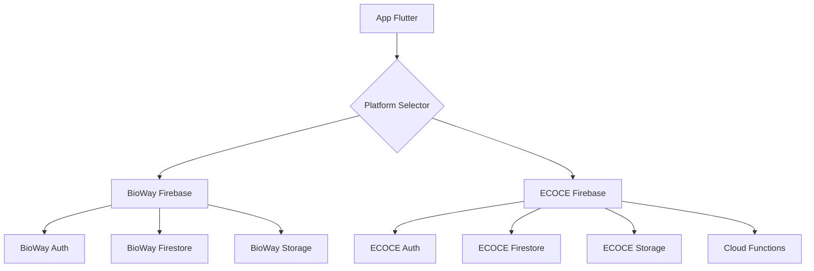
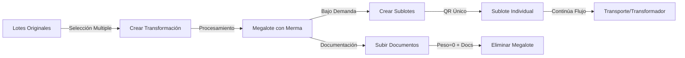

# Arquitectura y Sistema - BioWay México

## Índice
1. [Visión General](#visión-general)
2. [Arquitectura Técnica](#arquitectura-técnica)
3. [Base de Datos y Colecciones](#base-de-datos-y-colecciones)
4. [Sistema de Transformaciones y Sublotes](#sistema-de-transformaciones-y-sublotes)
5. [Cloud Functions](#cloud-functions)
6. [Seguridad y Reglas](#seguridad-y-reglas)
7. [Integración con Firebase](#integración-con-firebase)

---

## Visión General

BioWay México es una aplicación móvil Flutter que implementa un sistema completo de trazabilidad para materiales reciclables en México. El sistema soporta dos plataformas independientes (BioWay y ECOCE) mediante una arquitectura multi-tenant con Firebase.

### Características Principales

- **Dual Platform**: BioWay (pendiente) y ECOCE (producción)
- **Multi-Tenant Firebase**: Proyectos separados por plataforma
- **Sistema Unificado de Lotes**: ID único inmutable durante todo el ciclo
- **Transformaciones y Sublotes**: Procesamiento conjunto y división bajo demanda
- **QR Code Tracking**: Generación y escaneo para trazabilidad completa
- **Cloud Functions**: Automatización de procesos críticos

### Stack Tecnológico

```yaml
Frontend:
  - Flutter SDK: ^3.8.1
  - Dart: ^3.0.0
  
Backend:
  - Firebase Auth: Autenticación multi-tenant
  - Cloud Firestore: Base de datos NoSQL
  - Firebase Storage: Almacenamiento de archivos
  - Cloud Functions: Node.js 20
  
Librerías Principales:
  - mobile_scanner: ^7.0.1 (QR scanning)
  - qr_flutter: ^4.1.0 (QR generation)
  - pdf: ^3.11.0 (Document generation)
  - firebase_admin: ^11.11.1 (Cloud Functions)
```

---

## Arquitectura Técnica

### 1. Arquitectura Multi-Tenant



### 2. Inicialización por Plataforma

```dart
// NO se inicializa Firebase en main.dart
// Cada plataforma se inicializa después de selección:

// firebase_manager.dart
class FirebaseManager {
  static Future<void> initializeForPlatform(FirebasePlatform platform) async {
    final config = _getConfigForPlatform(platform);
    await Firebase.initializeApp(
      name: platform.name,
      options: config,
    );
  }
}
```

### 3. Estructura de Directorios

```
lib/
├── screens/
│   ├── splash_screen.dart              # Punto de entrada
│   ├── platform_selector_screen.dart   # Selección BioWay/ECOCE
│   ├── login/
│   │   ├── bioway/                    # Autenticación BioWay
│   │   └── ecoce/                     # Autenticación ECOCE
│   │       └── providers/             # Registro por rol
│   └── ecoce/
│       ├── origen/                    # Centro de Acopio/Planta
│       ├── reciclador/               # Procesamiento y transformación
│       ├── transporte/               # Logística y entregas
│       ├── transformador/            # Producción final
│       ├── laboratorio/              # Análisis (proceso paralelo)
│       ├── maestro/                  # Administración
│       └── repositorio/              # Visualización completa
├── services/
│   ├── firebase/
│   │   ├── firebase_manager.dart     # Multi-tenant management
│   │   ├── firebase_config.dart      # Configuraciones
│   │   └── auth_service.dart         # Autenticación
│   ├── lote_unificado_service.dart   # Sistema unificado
│   ├── transformacion_service.dart   # Megalotes y sublotes
│   └── document_service.dart         # Gestión documentos
├── models/
│   └── lotes/
│       ├── lote_unificado_model.dart
│       ├── transformacion_model.dart
│       └── sublote_model.dart
└── utils/
    ├── colors.dart                   # BioWayColors constants
    └── qr_utils.dart                # QR handling utilities
```

---

## Base de Datos y Colecciones

### Estructura Principal de Firestore

```yaml
# USUARIOS Y PERFILES
solicitudes_cuentas/              # Solicitudes pendientes de aprobación
├── [solicitudId]
│   ├── estado: "pendiente"/"aprobada"/"rechazada"
│   ├── datos_perfil: {...}
│   ├── documentos: {...}
│   └── usuario_id: string       # ID del usuario Auth creado

ecoce_profiles/                   # Índice principal de usuarios
├── [userId]
│   ├── path: "ecoce_profiles/[type]/usuarios/[userId]"
│   ├── folio: "A0000001"        # Formato según tipo
│   ├── aprobado: true/false
│   └── ecoce_tipo_actor: "A"/"P"/"R"/"T"/"V"/"L"/"M"

ecoce_profiles/[type]/usuarios/   # Datos completos por tipo
├── origen/centro_acopio/usuarios/
├── origen/planta_separacion/usuarios/
├── reciclador/usuarios/
├── transformador/usuarios/
├── transporte/usuarios/
└── laboratorio/usuarios/

# SISTEMA DE LOTES
lotes/                            # Colección principal unificada
├── [loteId]/
│   ├── datos_generales/         # Documento: 'info'
│   │   └── info
│   │       ├── id: string
│   │       ├── tipo_lote: "original"/"derivado"
│   │       ├── proceso_actual: "origen"/"transporte"/"reciclador"/"transformador"
│   │       ├── consumido_en_transformacion: boolean
│   │       ├── transformacion_id: string (si fue consumido)
│   │       └── peso_nace: number
│   ├── origen/                  # Documento: 'data'
│   │   └── data
│   ├── transporte/              # Documentos: 'fase_1', 'fase_2'
│   │   ├── fase_1              # Origen → Reciclador
│   │   └── fase_2              # Reciclador → Transformador
│   ├── reciclador/             # Documento: 'data'
│   │   └── data
│   ├── analisis_laboratorio/    # Lista de análisis (sin documentos)
│   └── transformador/          # Documento: 'data'
│       └── data

# TRANSFORMACIONES (MEGALOTES)
transformaciones/                 # Sistema de agrupación y procesamiento
├── [transformacionId]/
│   ├── datos_generales/         # Documento: 'info'
│   │   └── info
│   │       ├── tipo: "agrupacion_reciclador"
│   │       ├── usuario_id: string  # CRÍTICO: NO 'usuarioId'
│   │       ├── peso_total_entrada: number
│   │       ├── peso_disponible: number
│   │       ├── merma_proceso: number
│   │       ├── lotes_entrada: [{lote_id, peso, porcentaje, tipo_material}]
│   │       └── sublotes_generados: [string]
│   └── documentacion/           # Documentos requeridos
│       ├── f_tecnica_pellet
│       └── rep_result_reci

# CONTROL Y AUDITORÍA
users_pending_deletion/          # Trigger para Cloud Functions
├── [userId]
│   ├── status: "pending"/"completed"/"failed"
│   ├── created_at: timestamp
│   └── reason: string

audit_logs/                      # Logs de Cloud Functions
├── [logId]
│   ├── action: string
│   ├── timestamp: timestamp
│   └── details: {...}
```

### Nomenclatura de Documentos

**IMPORTANTE**: Los nombres de documentos varían según la colección:
- `datos_generales`: Usa documento `'info'`
- Procesos (origen, reciclador, transformador): Usan documento `'data'`
- `transporte`: Usa nombres de fase (`'fase_1'`, `'fase_2'`)

---

## Sistema de Transformaciones y Sublotes

### Conceptos Clave

1. **Transformación (Megalote)**: Agrupación virtual de múltiples lotes para procesamiento conjunto
2. **Sublote**: Nuevo lote derivado de una transformación con peso específico
3. **Consumo de Lotes**: Los lotes originales se marcan como `consumido_en_transformacion: true`
4. **Eliminación Automática**: Megalotes se eliminan cuando `pesoDisponible == 0` Y tienen documentación completa

### Flujo de Transformación



### Modelo de Datos

```dart
// TransformacionModel
class TransformacionModel {
  final String id;
  final String tipo; // 'agrupacion_reciclador'
  final DateTime fechaInicio;
  final DateTime? fechaFin;
  final String estado; // 'en_proceso', 'completada'
  final List<LoteEntrada> lotesEntrada;
  final double pesoTotalEntrada;
  final double pesoDisponible;
  final double mermaProceso;
  final List<String> sublotesGenerados;
  final String usuarioId;
  final Map<String, dynamic>? documentacion;
  
  // Lógica crítica de eliminación
  bool get debeSerEliminada => pesoDisponible <= 0 && tieneDocumentacion;
}

// Estructura de Sublote en lotes/
{
  "datos_generales": {
    "info": {
      "tipo_lote": "derivado",
      "transformacion_origen": "TRANS-001",
      "composicion": {
        "LOTE-001": {"peso_aportado": 50, "porcentaje": 50},
        "LOTE-002": {"peso_aportado": 50, "porcentaje": 50}
      }
    }
  }
}
```

### Implementación de Servicios

```dart
// transformacion_service.dart
class TransformacionService {
  // Crear transformación consumiendo lotes
  Future<String> crearTransformacion({
    required List<LoteUnificadoModel> lotes,
    required double mermaProceso,
  }) async {
    // 1. Crear documento de transformación
    // 2. Marcar lotes como consumidos
    // 3. Retornar ID de transformación
  }
  
  // Crear sublote bajo demanda
  Future<String> crearSublote({
    required String transformacionId,
    required double peso,
  }) async {
    // 1. Validar peso disponible
    // 2. Crear nuevo lote tipo 'derivado'
    // 3. Actualizar peso disponible
    // 4. Agregar a sublotes_generados
  }
}
```

---

## Cloud Functions

### Funciones Implementadas

1. **deleteAuthUser** (Firestore Trigger)
   - Trigger: `onCreate` en `users_pending_deletion/{userId}`
   - Elimina usuarios de Firebase Auth automáticamente
   - Actualiza estado y crea logs de auditoría

2. **cleanupOldDeletionRecords** (Scheduled)
   - Schedule: Diariamente a las 2:00 AM
   - Limpia registros de eliminación > 30 días
   - Previene acumulación de datos

3. **manualDeleteUser** (Callable)
   - Función HTTPS para eliminación manual
   - Requiere autenticación y rol maestro
   - Backup para casos de fallo automático

4. **healthCheck** (HTTP)
   - Endpoint público para verificación
   - URL: `https://us-central1-trazabilidad-ecoce.cloudfunctions.net/healthCheck`

### Implementación

```javascript
// functions/index.js
const functions = require('firebase-functions');
const admin = require('firebase-admin');

admin.initializeApp();

// Eliminación automática de usuarios
exports.deleteAuthUser = functions.firestore
  .document('users_pending_deletion/{userId}')
  .onCreate(async (snap, context) => {
    const userId = context.params.userId;
    
    try {
      await admin.auth().deleteUser(userId);
      await snap.ref.update({
        status: 'completed',
        completedAt: admin.firestore.FieldValue.serverTimestamp()
      });
      
      // Crear log de auditoría
      await admin.firestore().collection('audit_logs').add({
        action: 'user_deleted',
        userId: userId,
        timestamp: admin.firestore.FieldValue.serverTimestamp(),
        success: true
      });
    } catch (error) {
      await snap.ref.update({
        status: 'failed',
        error: error.message
      });
    }
  });
```

### Despliegue

```bash
# Usar Google Cloud Shell para evitar conflictos en Windows
cd functions
npm install
firebase deploy --only functions

# Verificar despliegue
curl https://us-central1-trazabilidad-ecoce.cloudfunctions.net/healthCheck
```

---

## Seguridad y Reglas

### Firestore Security Rules

```javascript
rules_version = '2';
service cloud.firestore {
  match /databases/{database}/documents {
    
    // Funciones auxiliares
    function isAuthenticated() {
      return request.auth != null;
    }
    
    function isOwner(userId) {
      return request.auth != null && request.auth.uid == userId;
    }
    
    function isMaestro() {
      return request.auth != null && 
             exists(/databases/$(database)/documents/maestros/$(request.auth.uid));
    }
    
    function getUserType() {
      return get(/databases/$(database)/documents/ecoce_profiles/$(request.auth.uid)).data.ecoce_tipo_actor;
    }
    
    // Reglas por colección
    match /lotes/{loteId}/{document=**} {
      allow read: if isAuthenticated();
      allow write: if isAuthenticated();
    }
    
    match /transformaciones/{transformacionId} {
      allow read: if isAuthenticated();
      allow create: if isAuthenticated() && 
        (getUserType() == 'R' || getUserType() == 'T');
      allow update: if isAuthenticated() && 
        resource.data.usuario_id == request.auth.uid;
      allow delete: if false;
    }
    
    match /solicitudes_cuentas/{solicitudId} {
      allow read: if isAuthenticated();
      allow create: if true; // Público para registro
      allow update: if isMaestro();
      allow delete: if isMaestro();
    }
    
    match /users_pending_deletion/{userId} {
      allow create: if isMaestro();
      allow read, update, delete: if false; // Solo Cloud Functions
    }
  }
}
```

### Storage Security Rules

```javascript
rules_version = '2';
service firebase.storage {
  match /b/{bucket}/o {
    match /ecoce/{allPaths=**} {
      allow read: if request.auth != null;
      allow write: if request.auth != null
                   && request.resource.size < 5 * 1024 * 1024; // 5MB max
    }
    
    match /firmas/{allPaths=**} {
      allow read: if request.auth != null;
      allow write: if request.auth != null;
    }
  }
}
```

---

## Integración con Firebase

### Configuración de Proyectos

```yaml
ECOCE (Producción):
  Project ID: trazabilidad-ecoce
  Package: com.biowaymexico.app
  API Keys: [Configuradas en firebase_config.dart]
  
BioWay (Pendiente):
  Project ID: bioway-mexico (sugerido)
  Package: com.biowaymexico.app
  Status: No creado
```

### Índices Requeridos

```javascript
// Índices compuestos necesarios
[
  {
    collectionGroup: "datos_generales",
    fields: [
      { fieldPath: "proceso_actual", order: "ASCENDING" },
      { fieldPath: "fecha_creacion", order: "DESCENDING" }
    ]
  },
  {
    collectionGroup: "transformaciones",
    fields: [
      { fieldPath: "usuario_id", order: "ASCENDING" },
      { fieldPath: "estado", order: "ASCENDING" },
      { fieldPath: "fecha_inicio", order: "DESCENDING" }
    ]
  }
]
```

### Patrones de Consulta

```dart
// Consulta con collectionGroup (mejor rendimiento)
FirebaseFirestore.instance
  .collectionGroup('datos_generales')
  .where('proceso_actual', isEqualTo: 'reciclador')
  .where('consumido_en_transformacion', isEqualTo: false)
  .orderBy('fecha_creacion', descending: true)
  .snapshots();

// Evitar where con usuario_id en collectionGroup (problemas de permisos)
// Mejor usar consultas directas a colecciones específicas
```

---

## Consideraciones de Rendimiento

1. **Compresión de Imágenes**: Target ~50KB
2. **Límite PDFs**: Máximo 5MB
3. **Paginación**: Límite de 20 items por consulta
4. **Cache Local**: Para transformaciones activas
5. **Lazy Loading**: Documentos bajo demanda

## Monitoreo y Métricas

- Firebase Console → Functions → Logs
- Firebase Console → Firestore → Usage
- Firebase Console → Storage → Usage
- Cloud Functions health check endpoint

---

*Documento actualizado: 2025-01-29*  
*Versión: 1.0.0*  
*Sistema de Trazabilidad BioWay México*