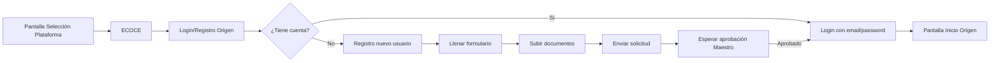
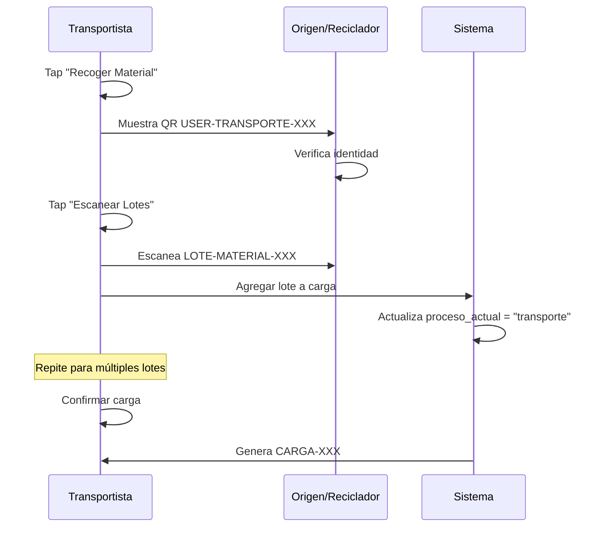
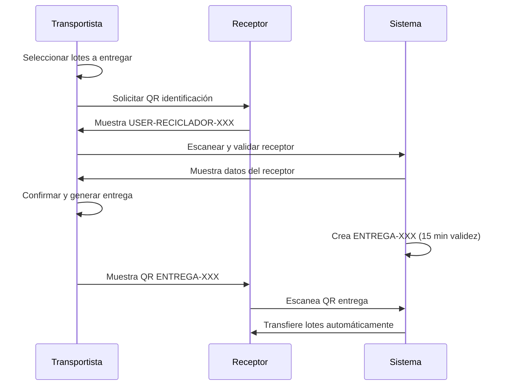
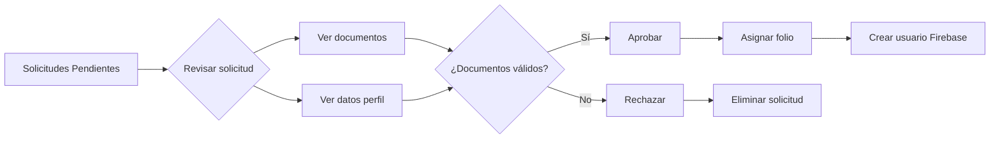
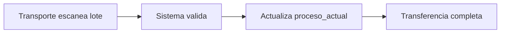
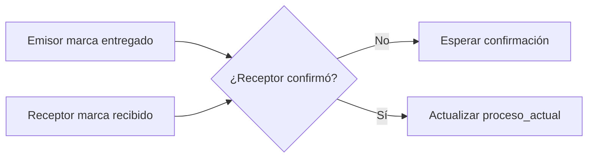
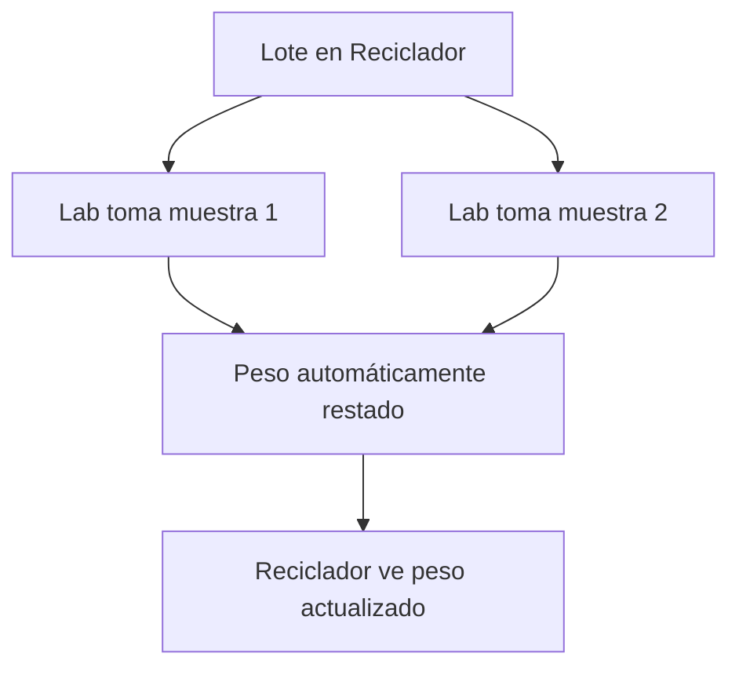

# Flujos de Usuario Completos - BioWay México

> **Última actualización**: 2025-01-26  
> **Versión**: 1.0.0  
> Documentación detallada de todos los flujos de usuario en el sistema

## Índice

1. [Flujo de Origen](#flujo-de-origen)
2. [Flujo del Transportista](#flujo-del-transportista)
3. [Flujo del Reciclador](#flujo-del-reciclador)
4. [Flujo del Laboratorio](#flujo-del-laboratorio)
5. [Flujo del Transformador](#flujo-del-transformador)
6. [Flujo del Maestro](#flujo-del-maestro)
7. [Flujo del Repositorio](#flujo-del-repositorio)
8. [Flujos de Transferencia](#flujos-de-transferencia)
9. [Casos de Uso Especiales](#casos-de-uso-especiales)

---

## Flujo de Origen

### Usuarios: Centro de Acopio (A) / Planta de Separación (P)

### 1. Registro e Inicio de Sesión



### 2. Crear Nuevo Lote

**Pasos detallados:**

1. **Iniciar creación**
   - Desde pantalla inicio, tap en botón "+"
   - Navega a `OrigenCrearLoteScreen`

2. **Seleccionar tipo de material**
   - Opciones: PEBD (POLI), PP, MULTILAMINADO
   - Cada material tiene color distintivo
   - Tap para seleccionar

3. **Completar formulario**
   ```
   Campos requeridos:
   - Peso inicial (kg) - numérico con decimales
   - Presentación - dropdown con opciones
   - Fuente del material - dropdown
   - Operador - pre-llenado con nombre del usuario
   - Ubicación - botón "Seleccionar ubicación" (opcional)
   - Observaciones - texto libre (opcional)
   ```

4. **Agregar evidencias fotográficas**
   - Mínimo 1, máximo 3 fotos
   - Opciones: Cámara o Galería
   - Compresión automática a ~50KB
   - Preview de fotos tomadas

5. **Guardar lote**
   - Validación de campos requeridos
   - Generación automática de:
     - ID único del lote
     - Código QR: `LOTE-[MATERIAL]-[ID]`
   - Guardado en Firebase
   - Navegación a pantalla de éxito

6. **Ver QR generado**
   - Pantalla muestra QR grande
   - Información del lote
   - Opciones: Compartir QR, Ver detalles

### 3. Gestión de Lotes

**Vista de lotes creados:**
- Lista filtrable por:
  - Tipo de material
  - Fecha de creación
  - Estado (disponible/recogido)
- Información mostrada:
  - ID del lote
  - Tipo y peso
  - Fecha creación
  - Estado actual

**Acciones disponibles:**
- Ver detalles completos
- Mostrar QR
- Ver historial (si ha sido recogido)

### 4. Estadísticas

- Total lotes creados
- Peso total por material
- Lotes disponibles vs recogidos
- Gráficos de producción mensual

---

## Flujo del Transportista

### Usuario: Transporte (V)

### 1. Proceso de Recogida (Pickup)



**Pasos detallados:**

1. **Identificación mutua**
   - Tap en "Recoger Material"
   - Mostrar QR de identificación al origen
   - Origen verifica identidad visualmente

2. **Escanear lotes**
   - Tap "Escanear Lotes"
   - Escanear cada QR de lote
   - Sistema valida:
     - Lote existe
     - Está en origen correcto
     - No ha sido recogido
   - Muestra lista de lotes escaneados

3. **Crear carga**
   - Revisar lotes agregados
   - Confirmar peso total
   - Sistema genera `CARGA-[ID]`
   - Actualiza `proceso_actual = "transporte"` para todos los lotes

### 2. Proceso de Entrega



**Pasos detallados:**

1. **Seleccionar lotes para entrega**
   - Ver lista de lotes en carga
   - Seleccionar cuáles entregar
   - Pueden ser todos o parcial

2. **Identificar receptor** (Paso 1 de 2)
   - Tap "Siguiente"
   - Escanear QR del receptor
   - Sistema muestra:
     - Nombre completo
     - Folio
     - Tipo de usuario
   - Validar que es el receptor correcto

3. **Generar QR de entrega** (Paso 2 de 2)
   - Confirmar datos de entrega
   - Sistema genera `ENTREGA-[ID]`
   - Navegación automática a pantalla QR
   - QR válido por 15 minutos
   - Muestra cuenta regresiva

4. **Receptor escanea QR**
   - Receptor usa su app para escanear
   - Transferencia automática de lotes
   - Actualización de `proceso_actual`

### 3. Gestión de Cargas

- Ver cargas activas
- Historial de entregas
- Lotes en tránsito
- Estadísticas de rutas

---

## Flujo del Reciclador

### Usuario: Reciclador (R)

### 1. Recepción de Material

**Proceso automático via QR de entrega:**

1. **Escanear QR de entrega**
   - Tap en FAB con ícono QR
   - Escanear `ENTREGA-XXX` del transportista
   - Sistema valida:
     - QR vigente (< 15 min)
     - Destinatario correcto

2. **Revisar información**
   - Lista de lotes a recibir
   - Peso total declarado
   - Datos del transportista (pre-llenados)

3. **Completar recepción**
   ```
   Campos requeridos:
   - Peso recibido (validar vs declarado)
   - Firma digital del receptor
   - Observaciones (opcional)
   ```

4. **Confirmar recepción**
   - Guardar datos
   - Actualizar `recepcion_completada = true`
   - Si entrega también completada: `proceso_actual = "reciclador"`
   - Lotes aparecen en "Mis Lotes"

### 2. Procesamiento de Lotes

**Selección y procesamiento:**

1. **Ver lotes disponibles**
   - Lista de lotes en proceso
   - Filtros por material, fecha
   - Indicador si tiene muestras de laboratorio

2. **Seleccionar lotes a procesar**
   - Selección múltiple permitida
   - Ver peso total seleccionado
   - Tap "Procesar Seleccionados"

3. **Completar formulario de salida**
   ```
   Campos requeridos:
   - Tipo de procesamiento (dropdown)
   - Tipo de venta (dropdown)
   - Peso procesado total
   - Operador (pre-llenado)
   - Firma digital
   - Evidencias (1-5 fotos)
   ```

4. **Guardar procesamiento**
   - Validación de datos
   - Actualización en Firebase
   - Lotes quedan listos para siguiente transporte

### 3. Gestión de Lotes

**Tres pestañas principales:**

1. **Recepción**
   - Lotes pendientes de procesar
   - Acciones: Ver detalles, Procesar

2. **Salida**
   - Lotes procesados esperando transporte
   - Muestra peso procesado
   - Indicador de muestras de lab

3. **Completados**
   - Historial de lotes transferidos
   - Solo lectura

### 4. Interacción con Laboratorio

- Lotes con ícono de probeta tienen muestras
- Peso mostrado ya tiene muestras restadas
- No requiere acción del reciclador
- Proceso transparente

---

## Flujo del Laboratorio

### Usuario: Laboratorio (L)

### 1. Toma de Muestras

**Proceso (sin transferencia de propiedad):**

1. **Ir físicamente al reciclador**
   - No hay transferencia digital previa
   - Coordinación directa con reciclador

2. **Escanear lote para muestra**
   - Tap en FAB → Scanner QR
   - Escanear `LOTE-XXX` en el reciclador
   - Sistema valida:
     - Lote existe
     - Está en proceso reciclador
     - Puede tomar múltiples muestras del mismo lote

3. **Registrar muestra**
   ```
   Campos requeridos:
   - Peso de la muestra (kg)
   - Firma digital del operador lab
   - Evidencias fotográficas (1-3)
   ```

4. **Guardar muestra**
   - No requiere firma del reciclador
   - Peso se resta automáticamente del lote
   - Lote sigue perteneciendo al reciclador
   - Muestra aparece en "Gestión de Muestras"

### 2. Gestión de Muestras

**Vista de muestras tomadas:**

1. **Lista de muestras**
   - Ordenadas por fecha
   - Información mostrada:
     - ID del lote
     - Fecha de toma
     - Peso de muestra
     - Estado del certificado

2. **Subir certificado** (proceso posterior)
   - Seleccionar muestra
   - Tap "Subir Certificado"
   - Seleccionar PDF (máx 5MB)
   - Certificado queda asociado

3. **Ver detalles**
   - Información completa del lote
   - Historial de la muestra
   - Evidencias fotográficas
   - Certificado (si existe)

### 3. Características Especiales

- **Sin transferencia**: `proceso_actual` nunca cambia a "laboratorio"
- **Proceso paralelo**: No interfiere con flujo principal
- **Múltiples muestras**: Un lote puede tener varias muestras
- **Peso dinámico**: Sistema resta automáticamente

---

## Flujo del Transformador

### Usuario: Transformador (T)

### 1. Recepción de Material

**Similar al reciclador:**

1. **Escanear QR de entrega**
   - FAB → Scanner QR
   - Escanear `ENTREGA-XXX`
   - Validación automática

2. **Completar recepción**
   - Peso recibido
   - Firma digital
   - Observaciones

3. **Confirmar**
   - Lotes pasan a "Pendientes"
   - `proceso_actual = "transformador"`

### 2. Proceso de Producción

**Tres pestañas de trabajo:**

#### Pestaña "Salida" (Procesamiento)

1. **Seleccionar lotes**
   - Lista de pendientes
   - Selección múltiple
   - Ver peso total

2. **Procesar lotes**
   ```
   Campos requeridos:
   - Peso de salida (producto final)
   - Producto fabricado (dropdown)
   - Procesos aplicados (multiselect)
   - Operador
   - Firma digital
   - Evidencias (1-5 fotos)
   ```

3. **Guardar**
   - Estado cambia a "documentacion"
   - Lotes pasan a pestaña "Documentación"

#### Pestaña "Documentación"

1. **Seleccionar lote**
   - Solo lotes en estado "documentacion"
   - Tap para abrir formulario

2. **Subir documentos**
   - Tipos requeridos según proceso
   - PDF o imágenes
   - Máximo 5MB por archivo

3. **Completar documentación**
   - Verificar todos los documentos
   - Confirmar envío
   - Estado cambia a "completado"

#### Pestaña "Completados"

- Historial de lotes finalizados
- Solo lectura
- Acceso a toda la documentación

### 3. Estadísticas de Producción

- Productos fabricados por tipo
- Peso procesado vs peso recibido
- Eficiencia de producción
- Tendencias mensuales

---

## Flujo del Maestro

### Usuario: Maestro (M)

### 1. Aprobación de Cuentas



**Proceso detallado:**

1. **Ver solicitudes pendientes**
   - Lista con filtros por tipo
   - Ordenadas por fecha
   - Indicador de documentos completos

2. **Revisar solicitud individual**
   - Datos del perfil completos
   - Documentos subidos:
     - Constancia Situación Fiscal
     - Permisos ambientales
     - Documentos específicos por tipo
   - Validar autenticidad

3. **Tomar decisión**
   - **Aprobar**:
     - Sistema asigna folio automático
     - Crea usuario en Firebase Auth
     - Envía credenciales (futuro: email)
   - **Rechazar**:
     - Agregar razón de rechazo
     - Elimina solicitud
     - Notifica al solicitante (futuro)

### 2. Gestión de Usuarios

1. **Ver usuarios activos**
   - Lista por tipo de usuario
   - Búsqueda por folio/nombre
   - Estados: Activo/Suspendido

2. **Editar usuario**
   - Actualizar datos de perfil
   - Cambiar permisos
   - Suspender/Reactivar cuenta

3. **Eliminar usuario**
   - Confirmación requerida
   - Marca para eliminación
   - Cloud Function elimina de Auth

### 3. Administración del Sistema

- Ver estadísticas globales
- Configurar parámetros del sistema
- Gestionar catálogos (materiales, procesos)
- Exportar reportes

---

## Flujo del Repositorio

### Usuario: Repositorio (RE) - Solo Lectura

### 1. Visualización de Lotes

**Vista completa del sistema:**

1. **Pantalla principal**
   - Contador total de lotes
   - Buscador por ID de lote
   - Filtros avanzados

2. **Filtros disponibles**
   ```
   - Tipo de material (PEBD, PP, Multi)
   - Proceso actual (origen, transporte, etc.)
   - Rango de fechas
   - Estado del lote
   ```

3. **Lista de resultados**
   - Información resumida
   - Proceso actual destacado
   - Indicadores visuales de estado

### 2. Detalle de Lote

**Información completa disponible:**

1. **Datos generales**
   - ID y QR code
   - Fechas de creación/modificación
   - Historial de procesos
   - Peso actual vs inicial

2. **Trazabilidad completa**
   - Timeline de eventos
   - Usuarios involucrados
   - Firmas digitales
   - Evidencias fotográficas

3. **Documentación**
   - Acceso a todos los documentos
   - Certificados de laboratorio
   - Documentos del transformador

### 3. Reportes y Análisis

- Exportar datos a Excel (futuro)
- Gráficos de tendencias
- Análisis por período
- Métricas de eficiencia

---

## Flujos de Transferencia

### Tipos de Transferencia

#### 1. Transferencia Unidireccional (Pickup)

**Usado cuando**: Transporte recoge de Origen o Reciclador



**Características**:
- Inmediata al escanear
- No requiere confirmación del origen
- Usado en recogidas

#### 2. Transferencia Bidireccional (Entrega)

**Usado cuando**: Se requiere confirmación de ambas partes



**Características**:
- Requiere confirmación de ambos
- Validación de pesos
- Firmas digitales

### Reglas de Transferencia

1. **Validaciones automáticas**
   - Proceso origen correcto
   - Usuario autorizado
   - Estado del lote válido

2. **Actualizaciones en cascada**
   - `proceso_actual` se actualiza
   - Se agrega a `historial_procesos`
   - Se preservan datos anteriores

3. **Notificaciones** (futuro)
   - Al completar transferencia
   - Si hay discrepancias de peso
   - En timeouts de entrega

---

## Casos de Uso Especiales

### 1. Lote con Múltiples Análisis de Laboratorio



**Consideraciones**:
- Cada muestra resta del peso disponible
- Muestras independientes entre sí
- Certificados se suben por separado
- Historial completo visible

### 2. Entrega Parcial de Carga

**Escenario**: Transportista entrega solo parte de su carga

1. Seleccionar subset de lotes
2. Generar QR solo para esos lotes
3. Resto permanece en transporte
4. Permite múltiples entregas

### 3. Rechazo de Material

**Escenario**: Receptor rechaza por calidad

1. Escanear QR de entrega
2. En lugar de confirmar, rechazar
3. Agregar razón de rechazo
4. Lotes regresan a estado anterior
5. Se registra intento fallido

### 4. Timeout de Entrega

**Escenario**: QR de entrega expira (>15 min)

1. Receptor intenta escanear
2. Sistema muestra "QR expirado"
3. Transportista debe generar nuevo QR
4. Proceso se reinicia

### 5. Corrección de Datos

**Escenario**: Error en peso o datos

- Solo Maestro puede corregir
- Se preserva historial de cambios
- Razón de cambio requerida
- Notificación a involucrados

---

## Mejores Prácticas

### Para Todos los Usuarios

1. **Siempre verificar identidad** antes de transferencias
2. **Revisar pesos** antes de confirmar
3. **Tomar evidencias fotográficas** claras
4. **Completar todos los campos** requeridos
5. **No compartir credenciales** de acceso

### Para Implementadores

1. **Validar en cliente y servidor**
2. **Manejar estados offline**
3. **Implementar reintentos** automáticos
4. **Logs detallados** para debugging
5. **Pruebas en cada flujo** completo

---

*Documento actualizado al 2025-01-26*  
*Para dudas técnicas, consultar CLAUDE.md*