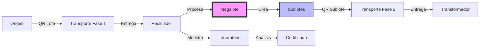
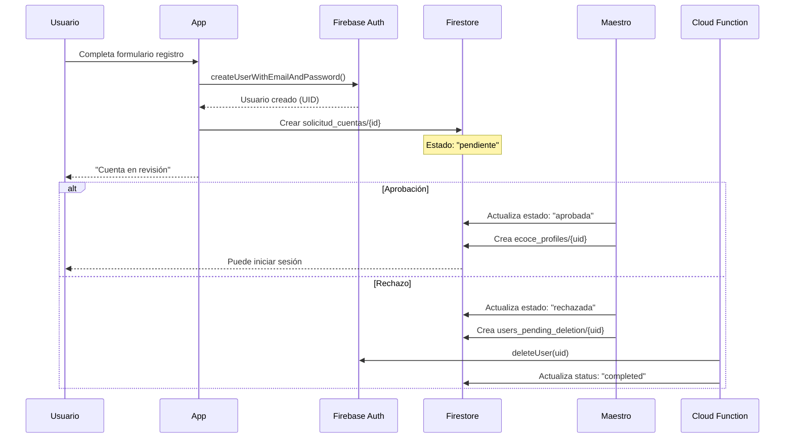
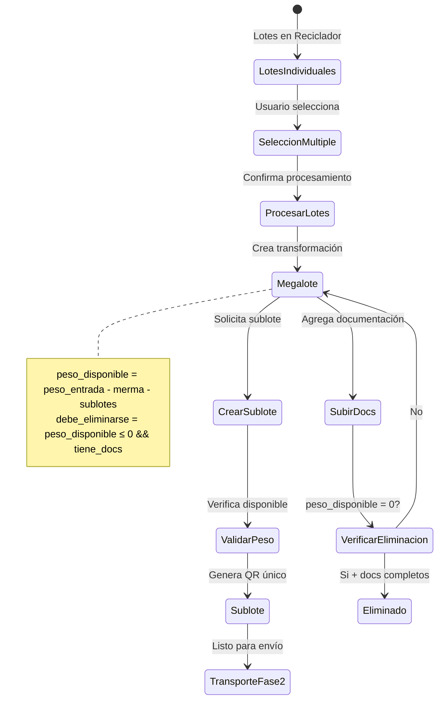
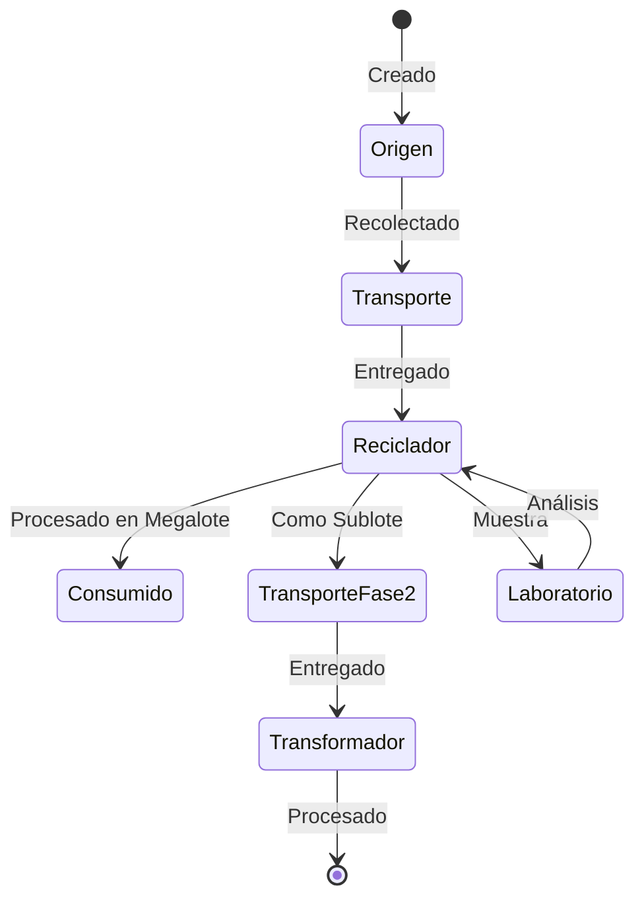
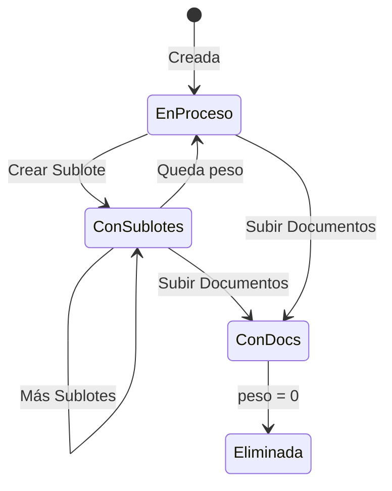

# Flujos y Procesos de Negocio - BioWay México

## Índice
1. [Visión General del Sistema](#visión-general-del-sistema)
2. [Tipos de Usuario y Roles](#tipos-de-usuario-y-roles)
3. [Flujo de Registro y Aprobación](#flujo-de-registro-y-aprobación)
4. [Flujo Principal de Materiales](#flujo-principal-de-materiales)
5. [Sistema de Transformaciones (Megalotes)](#sistema-de-transformaciones-megalotes)
6. [Procesos por Tipo de Usuario](#procesos-por-tipo-de-usuario)
7. [Sistema de QR y Trazabilidad](#sistema-de-qr-y-trazabilidad)
8. [Reglas de Negocio Críticas](#reglas-de-negocio-críticas)

---

## Visión General del Sistema

El sistema BioWay México gestiona el ciclo completo de materiales reciclables desde su origen hasta su transformación final. Cada material se rastrea mediante códigos QR únicos y mantiene su trazabilidad completa a través de múltiples actores en la cadena de suministro.

### Flujo Principal



---

## Tipos de Usuario y Roles

### 1. Origen (Código: A/P)
- **Centro de Acopio** (A): Folio A0000001
- **Planta de Separación** (P): Folio P0000001
- **Función**: Crear lotes iniciales de material reciclable
- **Materiales**: PEBD (rosa), PP (morado), Multilaminado (café)

### 2. Transporte (Código: V)
- **Folio**: V0000001
- **Función**: Recolectar y entregar materiales
- **Fases**:
  - Fase 1: Origen → Reciclador
  - Fase 2: Reciclador → Transformador

### 3. Reciclador (Código: R)
- **Folio**: R0000001
- **Función**: Procesar materiales y crear sublotes
- **Capacidades Especiales**:
  - Crear transformaciones (megalotes)
  - Generar sublotes bajo demanda
  - Gestionar merma del proceso

### 4. Laboratorio (Código: L)
- **Folio**: L0000001
- **Función**: Análisis de muestras (proceso paralelo)
- **Característica**: No transfiere propiedad del lote

### 5. Transformador (Código: T)
- **Folio**: T0000001
- **Función**: Producción final (pellets, flakes)
- **Entrada**: Sublotes del reciclador

### 6. Maestro (Código: M)
- **Función**: Administración del sistema
- **Capacidades**:
  - Aprobar/rechazar cuentas
  - Gestionar usuarios
  - Acceso completo al sistema

### 7. Repositorio
- **Función**: Visualización completa (solo lectura)
- **Acceso**: Toda la trazabilidad del sistema

---

## Flujo de Registro y Aprobación

### 1. Registro de Usuario



### 2. Estructura de Solicitud

```javascript
// solicitudes_cuentas/{solicitudId}
{
  "estado": "pendiente", // "pendiente", "aprobada", "rechazada"
  "tipo_usuario": "centro_acopio",
  "usuario_id": "firebase-auth-uid", // ID del usuario ya creado
  "fecha_solicitud": Timestamp,
  "datos_perfil": {
    "nombre_completo": "Juan Pérez",
    "telefono": "5551234567",
    "email": "juan@ejemplo.com",
    "direccion": {...}
  },
  "documentos": {
    "constancia_situacion_fiscal": "url_storage",
    "identificacion_oficial": "url_storage",
    "comprobante_domicilio": "url_storage"
  }
}
```

### 3. Validaciones de Aprobación

- Usuario Auth debe existir antes de aprobar
- Folio se asigna automáticamente según tipo
- Profile path se calcula según tipo de usuario
- Documentos deben estar completos

---

## Flujo Principal de Materiales

### 1. Creación de Lote (Origen)

```dart
// Proceso en Origen
1. Seleccionar tipo de material (PEBD/PP/Multi)
2. Capturar peso inicial
3. Tomar fotografías de evidencia
4. Firmar digitalmente
5. Sistema genera:
   - ID único: LOTE-[timestamp]-[random]
   - QR Code: "LOTE-PEBD-[id]"
   - Registro en Firestore
```

### 2. Recolección (Transporte)

```dart
// Proceso Transporte Fase 1
1. Escanear QR de lotes en origen
2. Crear carga con múltiples lotes
3. Generar guía de transporte
4. Al entregar:
   - Marcar entrega_completada: true
   - Esperar recepción del reciclador
```

### 3. Recepción y Procesamiento (Reciclador)

```dart
// Recepción
1. Escanear QR de entrega
2. Verificar lotes incluidos
3. Confirmar pesos
4. Firmar recepción
5. proceso_actual → "reciclador"

// Procesamiento (Transformación)
1. Seleccionar múltiples lotes
2. Crear transformación (megalote)
3. Registrar merma del proceso
4. Lotes originales → consumido_en_transformacion: true
```

### 4. Análisis de Laboratorio (Paralelo)

```dart
// Proceso sin transferencia
1. Escanear lote/megalote del reciclador
2. Registrar peso de muestra
3. Peso se resta automáticamente
4. Realizar análisis
5. Subir certificado
6. NO cambia proceso_actual
```

### 5. Entrega Final (Transformador)

```dart
// Recepción de sublotes
1. Transporte escanea sublotes
2. Transformador recibe
3. Procesa material
4. Registra producción final
5. Cierra ciclo del sublote
```

---

## Sistema de Transformaciones (Megalotes)

### Concepto de Megalote

Un megalote es una agrupación virtual de múltiples lotes para procesamiento conjunto. Los lotes originales se "consumen" y el material procesado está disponible para crear sublotes bajo demanda.

### Flujo Detallado



### Estructura de Transformación

```javascript
// transformaciones/{transformacionId}/datos_generales/info
{
  "tipo": "agrupacion_reciclador",
  "usuario_id": "uid-reciclador", // CRÍTICO: no 'usuarioId'
  "fecha_inicio": Timestamp,
  "estado": "en_proceso",
  "lotes_entrada": [
    {
      "lote_id": "LOTE-001",
      "peso": 100.0,
      "porcentaje": 33.33,
      "tipo_material": "PEBD"
    },
    {
      "lote_id": "LOTE-002", 
      "peso": 200.0,
      "porcentaje": 66.67,
      "tipo_material": "PEBD"
    }
  ],
  "peso_total_entrada": 300.0,
  "merma_proceso": 30.0,
  "peso_disponible": 270.0, // Se reduce al crear sublotes
  "sublotes_generados": ["SUB-001", "SUB-002"],
  "proceso_aplicado": "Separación y limpieza",
  "observaciones": "Material en buen estado"
}
```

### Creación de Sublotes

```dart
// Proceso de creación
1. Usuario solicita crear sublote desde megalote
2. Ingresa peso deseado
3. Sistema valida: peso ≤ peso_disponible
4. Crea nuevo lote con:
   - tipo_lote: "derivado"
   - transformacion_origen: "TRANS-001"
   - composicion: hereda de lotes_entrada
5. Actualiza peso_disponible del megalote
6. Genera QR único para sublote
```

### Documentación Requerida

- **Ficha Técnica de Pellet** (`f_tecnica_pellet`)
- **Reporte de Resultado de Reciclador** (`rep_result_reci`)

---

## Procesos por Tipo de Usuario

### Origen - Centro de Acopio

1. **Inicio de Sesión** → Dashboard con estadísticas
2. **Crear Lote**:
   - Seleccionar tipo material
   - Capturar peso
   - Evidencia fotográfica (mín. 1)
   - Firma digital
   - Generar QR
3. **Gestión**:
   - Ver lotes creados
   - Estadísticas por material
   - Historial completo

### Transporte

1. **Escanear para Recolectar**:
   - Escaneo múltiple de QRs
   - Crear carga
   - Generar guía
2. **Entregar**:
   - Seleccionar carga
   - Registrar entrega
   - Firma del receptor
3. **Tipos de Carga**:
   - Lotes originales (Fase 1)
   - Sublotes (Fase 2)

### Reciclador

1. **Recepción**:
   - Escanear entrega
   - Verificar contenido
   - Firmar recepción
2. **Procesamiento**:
   - Tab "Salida" → Selección múltiple
   - Crear transformación
   - Registrar merma
3. **Gestión de Megalotes**:
   - Tab "Completados" → Ver megalotes
   - Crear sublotes bajo demanda
   - Subir documentación
4. **Toma de Muestras**:
   - Generar QR para laboratorio
   - Registrar peso muestra

### Laboratorio

1. **Toma de Muestra**:
   - Escanear QR de muestra
   - Registrar peso
   - Evidencia fotográfica
2. **Análisis**:
   - Ver muestras pendientes
   - Subir certificados
   - Completar análisis

### Transformador

1. **Recepción de Sublotes**:
   - Escanear entrega
   - Verificar composición
   - Confirmar recepción
2. **Procesamiento Final**:
   - Registrar producción
   - Documentar proceso
   - Cerrar ciclo

### Maestro

1. **Gestión de Solicitudes**:
   - Revisar pendientes
   - Verificar documentos
   - Aprobar/Rechazar
2. **Administración**:
   - Gestión de usuarios
   - Reportes del sistema
   - Auditoría

---

## Sistema de QR y Trazabilidad

### Formato de Códigos QR

```javascript
// Lotes originales
"LOTE-[TIPO_MATERIAL]-[ID]"
Ejemplo: "LOTE-PEBD-20250128-ABC123"

// Sublotes
"SUBLOTE-[ID]"
Ejemplo: "SUBLOTE-20250128-XYZ789"

// Entregas
"ENTREGA-[ID]"
Ejemplo: "ENTREGA-TRANS-20250128-123"

// Muestras laboratorio
"MUESTRA-MEGALOTE-[ID]"
Ejemplo: "MUESTRA-MEGALOTE-TRANS001"
```

### Utilidades QR

```dart
// QRUtils - Manejo consistente
class QRUtils {
  // Extraer ID de cualquier QR
  static String extractLoteIdFromQR(String qrCode) {
    if (qrCode.startsWith('LOTE-')) {
      final parts = qrCode.split('-');
      return parts.sublist(2).join('-');
    }
    // Manejo para otros formatos...
  }
  
  // Generar QR para lote
  static String generateLoteQR(String tipoMaterial, String loteId) {
    return 'LOTE-$tipoMaterial-$loteId';
  }
}
```

### Trazabilidad Completa

Cada entidad mantiene referencias para trazabilidad bidireccional:

```yaml
Lote Original:
  - transformacion_id: "TRANS-001" (si fue consumido)
  - consumido_en_transformacion: true/false

Transformación:
  - lotes_entrada: [array con detalles]
  - sublotes_generados: [array de IDs]

Sublote:
  - transformacion_origen: "TRANS-001"
  - composicion: {mapa de aportes}
  - tipo_lote: "derivado"
```

---

## Reglas de Negocio Críticas

### 1. Transferencias y Propiedad

- **Regla**: El `proceso_actual` solo cambia cuando ambas partes confirman
- **Excepción**: Reciclador → Transporte es unidireccional
- **Laboratorio**: Nunca cambia `proceso_actual` (proceso paralelo)

### 2. Pesos y Cálculos

```dart
// Peso actual dinámico
double get pesoActual {
  if (proceso == 'origen') return pesoNace;
  if (proceso == 'reciclador') {
    return pesoProcesado - pesoMuestrasLaboratorio;
  }
  if (proceso == 'transporte') {
    return pesoEntregado ?? pesoRecogido ?? pesoAnterior;
  }
  // ... más lógica
}
```

### 3. Consumo de Lotes

- Lotes marcados como `consumido_en_transformacion: true` desaparecen de "Salida"
- No se pueden transferir lotes consumidos
- La trazabilidad se mantiene a través de la transformación

### 4. Eliminación de Megalotes

```dart
// Condiciones para eliminación automática
bool get debeSerEliminada {
  return pesoDisponible <= 0 && tieneDocumentacion;
}

// Documentación completa
bool get tieneDocumentacion {
  return documentacion != null &&
         documentacion!['f_tecnica_pellet'] != null &&
         documentacion!['rep_result_reci'] != null;
}
```

### 5. Visibilidad de Lotes

Los lotes aparecen en las pantallas según `proceso_actual`:

```dart
// Query para lotes del reciclador
where('proceso_actual', isEqualTo: 'reciclador')
where('consumido_en_transformacion', isEqualTo: false)
```

### 6. Folios y Nomenclatura

- Formato estricto: `[LETRA][NÚMERO_7_DÍGITOS]`
- Se asignan secuencialmente por tipo
- Ejemplos: A0000001, R0000001, V0000001

### 7. Documentos y Archivos

- Imágenes: Compresión a ~50KB
- PDFs: Máximo 5MB
- Storage: Rutas organizadas por tipo/usuario/fecha

### 8. Firmas Digitales

- Dimensiones: 300x120 px
- AspectRatio: 2.5
- Se almacenan como rutas en Firestore
- Archivo real en Firebase Storage

---

## Estados y Transiciones

### Estados de Lote



### Estados de Transformación



---

## Consideraciones Especiales

1. **Multi-dispositivo**: Un usuario puede acceder desde múltiples dispositivos
2. **Offline**: Operaciones críticas requieren conexión
3. **Concurrencia**: Las transformaciones usan transacciones
4. **Performance**: Usar `collectionGroup` para consultas optimizadas
5. **Seguridad**: Validación en cliente y servidor

---

*Documento actualizado: 2025-01-29*  
*Versión: 1.0.0*  
*Sistema de Trazabilidad BioWay México*