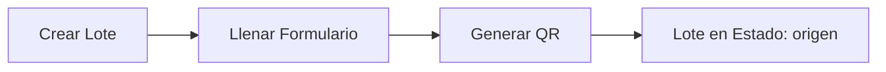
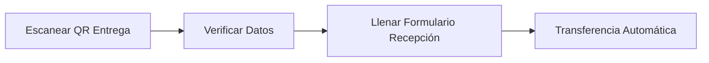
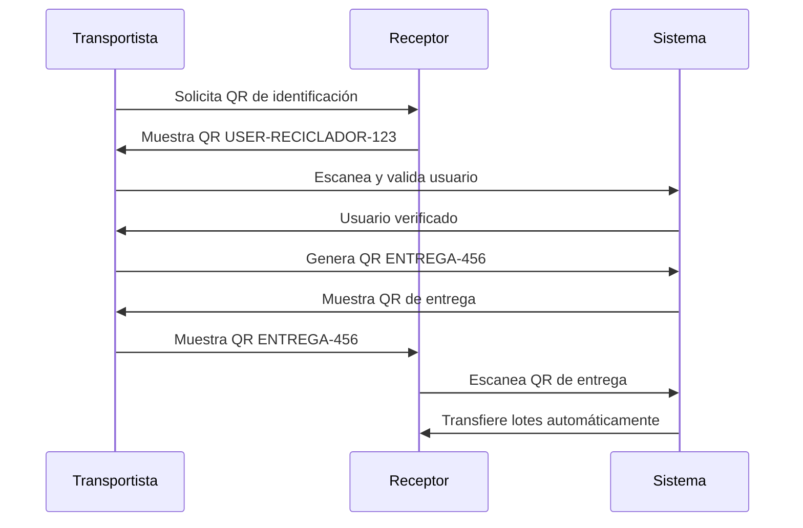

# Sistema de Trazabilidad y Gestión de Lotes - BioWay México

> **Última actualización**: 2025-01-26  
> **Versión del sistema**: 1.0.0+1  
> **Estado**: Producción (ECOCE) / Pendiente configuración (BioWay)

## Índice
1. [Introducción](#introducción)
2. [Arquitectura del Sistema](#arquitectura-del-sistema)
3. [Modelo de Datos Unificado](#modelo-de-datos-unificado)
4. [Flujos de Usuario](#flujos-de-usuario)
5. [Sistema de Identificación por QR](#sistema-de-identificación-por-qr)
6. [Implementación Técnica](#implementación-técnica)
7. [Integración con Sistema Unificado](#integración-con-sistema-unificado)
8. [Correcciones y Mejoras Realizadas](#correcciones-y-mejoras-realizadas)
9. [Guía de Mantenimiento](#guía-de-mantenimiento)
10. [Pruebas y Validación](#pruebas-y-validación)

## Introducción

El sistema de trazabilidad de BioWay México es una aplicación móvil Flutter en producción que proporciona seguimiento completo de materiales reciclables a través de toda la cadena de suministro. Implementa un modelo de datos unificado con transferencias automáticas mediante códigos QR, garantizando la trazabilidad e integridad de los datos desde el origen hasta la transformación final.

### Características Principales

#### Funcionales
- **Trazabilidad completa**: Seguimiento en tiempo real desde origen hasta producto final
- **Sistema QR multicapa**: 4 tipos de códigos para diferentes operaciones
- **Modelo unificado**: ID inmutable que persiste durante todo el ciclo de vida
- **Transferencias inteligentes**: Unidireccionales (pickup) y bidireccionales (entrega)
- **Proceso paralelo**: Laboratorio opera sin transferir propiedad
- **Cálculo dinámico**: Pesos se actualizan automáticamente según el proceso

#### Técnicas
- **Multi-tenant Firebase**: Aislamiento completo entre plataformas
- **Offline-first**: Operaciones críticas funcionan sin conectividad
- **Compresión automática**: Imágenes a 50KB, PDFs a 5MB máximo
- **Seguridad integrada**: Autenticación, autorización y validación en cada operación
- **Escalabilidad**: Arquitectura preparada para crecimiento

## Arquitectura del Sistema

### Estructura de Base de Datos (Firestore)

#### Colección Principal: `lotes/`
```
lotes/
└── {loteId}/                             # ID único autogenerado (inmutable)
    ├── datos_generales/                  # Información central del lote
    │   └── info
    │       ├── id: String                # Identificador único del lote
    │       ├── fecha_creacion: Timestamp # Momento de creación
    │       ├── creado_por: String        # UID del usuario origen
    │       ├── creado_por_folio: String  # Folio del creador
    │       ├── proceso_actual: String    # Estado actual: "origen"|"transporte"|"reciclador"|"transformador"
    │       ├── estado_actual: String     # Estado general del lote
    │       ├── historial_procesos: Array # ["origen", "transporte", "reciclador", ...]
    │       ├── qr_code: String           # Formato: "LOTE-{MATERIAL}-{ID}"
    │       ├── tipo_material: String     # PEBD, PP, MULTILAMINADO
    │       ├── presentacion: String      # Forma física del material
    │       ├── fuente: String            # Origen del material
    │       └── peso_nace: double         # Peso inicial (nunca cambia)
    │
    ├── origen/                           # Proceso inicial
    │   └── data
    │       ├── fecha_creacion: Timestamp
    │       ├── operador: String
    │       ├── ubicacion: GeoPoint
    │       ├── evidencias_foto: Array<String>
    │       └── observaciones: String
    │
    ├── transporte/                       # Fases de transporte (Map)
    │   ├── fase_1/                       # Origen → Reciclador
    │   │   ├── recogida/
    │   │   │   ├── fecha_recogida: Timestamp
    │   │   │   ├── transportista_id: String
    │   │   │   ├── transportista_folio: String
    │   │   │   ├── peso_recogido: double
    │   │   │   └── origen_id: String
    │   │   └── entrega/
    │   │       ├── fecha_entrega: Timestamp
    │   │       ├── peso_entregado: double
    │   │       ├── destinatario_id: String
    │   │       ├── destinatario_folio: String
    │   │       ├── firma_receptor: String (URL)
    │   │       ├── entrega_completada: boolean
    │   │       └── recepcion_completada: boolean
    │   └── fase_2/                       # Reciclador → Transformador
    │       └── (misma estructura que fase_1)
    │
    ├── reciclador/                       # Procesamiento
    │   └── data
    │       ├── recepcion/
    │       │   ├── fecha_recepcion: Timestamp
    │       │   ├── peso_recibido: double
    │       │   └── firma_receptor: String (URL)
    │       └── salida/
    │           ├── fecha_salida: Timestamp
    │           ├── peso_procesado: double
    │           ├── tipo_procesamiento: String
    │           ├── firma_salida: String (URL)
    │           └── evidencias_foto: Array<String>
    │
    ├── analisis_laboratorio/             # Análisis (proceso paralelo)
    │   └── {analysisId}/
    │       ├── id: String
    │       ├── fecha_toma: Timestamp
    │       ├── usuario_id: String
    │       ├── folio_laboratorio: String
    │       ├── peso_muestra: double     # Se resta automáticamente del peso disponible
    │       ├── firma_operador: String (URL)
    │       ├── evidencias_foto: Array<String>
    │       └── certificado: String (URL) # Opcional, se sube después
    │
    └── transformador/                    # Producción final
        └── data
            ├── recepcion/
            │   ├── fecha_recepcion: Timestamp
            │   └── peso_recibido: double
            ├── salida/
            │   ├── fecha_salida: Timestamp
            │   ├── peso_salida: double
            │   ├── producto_fabricado: String
            │   └── procesos_aplicados: Array<String>
            └── especificaciones/
                ├── estado: String        # "pendiente"|"documentacion"|"completado"
                └── documentos: Map       # URLs de documentos subidos
```

### Tipos de Usuario y Sistema de Folios

#### Estructura de Folios
Cada usuario tiene un folio único que sigue el patrón: `[PREFIJO][NÚMERO_SECUENCIAL]`

| Tipo de Usuario | Prefijo | Ejemplo | Descripción | Permisos Principales |
|----------------|---------|---------|-------------|---------------------|
| **Centro de Acopio** | A | A0000001 | Origen - Recolecta material inicial | Crear lotes, generar QR |
| **Planta de Separación** | P | P0000001 | Origen - Separa y clasifica | Crear lotes, generar QR |
| **Reciclador** | R | R0000001 | Procesa material recibido | Recibir, procesar, entregar |
| **Transformador** | T | T0000001 | Producción final | Recibir, transformar, documentar |
| **Transporte** | V | V0000001 | Logística entre procesos | Recoger, transportar, entregar |
| **Laboratorio** | L | L0000001 | Análisis de calidad | Tomar muestras, certificar |
| **Maestro** | M | M0000001 | Administrador del sistema | Aprobar cuentas, gestión total |
| **Repositorio** | RE | RE000001 | Visualización completa | Solo lectura, reportes |

#### Asignación de Folios
- Se asignan automáticamente al aprobar una cuenta
- Son únicos e inmutables
- Se usan para identificación en toda la aplicación
- Aparecen en los códigos QR de usuario

## Modelo de Datos Unificado

### LoteUnificadoModel - Estructura Central

```dart
class LoteUnificadoModel {
  // Identificación inmutable
  final String id;                                    
  
  // Información general del lote
  final DatosGeneralesLote datosGenerales;
  
  // Datos por proceso (null si no ha pasado por ese proceso)
  final ProcesoOrigenData? origen;
  final Map<String, ProcesoTransporteData> transporteFases;  // fase_1, fase_2
  final ProcesoRecicladorData? reciclador;
  final List<AnalisisLaboratorioData> analisisLaboratorio;   // Múltiples análisis posibles
  final ProcesoTransformadorData? transformador;
  
  // Getters computados
  double get pesoActual => _calcularPesoActual();
  bool get tieneAnalisisLab => analisisLaboratorio.isNotEmpty;
  String get estadoVisual => _determinarEstadoVisual();
}
```

### DatosGeneralesLote - Información Core

```dart
class DatosGeneralesLote {
  final String id;
  final DateTime fechaCreacion;
  final String creadoPor;              // UID del usuario
  final String creadoPorFolio;         // Folio del usuario
  final String procesoActual;          // Dónde está actualmente
  final String estadoActual;           // Estado general
  final List<String> historialProcesos;
  final String qrCode;
  final String tipoMaterial;           // PEBD, PP, MULTILAMINADO
  final String presentacion;           // Forma física
  final String fuente;                 // Origen del material
  final double pesoNace;               // Peso inicial (inmutable)
  final Map<String, dynamic>? metadata; // Datos adicionales
}
```

### Características Avanzadas del Modelo

#### 1. **Inmutabilidad de Datos**
- El ID nunca cambia durante todo el ciclo
- Los datos históricos se preservan siempre
- Nuevos procesos agregan datos, no modifican anteriores

#### 2. **Cálculo Dinámico de Peso**
```dart
double _calcularPesoActual() {
  // Prioridad de peso según el proceso más reciente
  if (transformador?.salida?.pesoSalida != null) {
    return transformador!.salida!.pesoSalida!;
  }
  
  // Verificar fases de transporte
  final fase2Peso = transporteFases['fase_2']?.entrega?.pesoEntregado ??
                    transporteFases['fase_2']?.recogida?.pesoRecogido;
  if (fase2Peso != null) return fase2Peso;
  
  // Peso del reciclador menos muestras de laboratorio
  if (reciclador?.salida?.pesoProcesado != null) {
    final pesoBase = reciclador!.salida!.pesoProcesado!;
    final pesoMuestras = analisisLaboratorio.fold(0.0, 
      (sum, analisis) => sum + (analisis.pesoMuestra ?? 0));
    return pesoBase - pesoMuestras;
  }
  
  // Fase 1 de transporte
  final fase1Peso = transporteFases['fase_1']?.entrega?.pesoEntregado ??
                    transporteFases['fase_1']?.recogida?.pesoRecogido;
  if (fase1Peso != null) return fase1Peso;
  
  // Peso inicial como fallback
  return datosGenerales.pesoNace;
}
```

#### 3. **Trazabilidad Completa**
- Historial de procesos registrado
- Timestamps en cada operación
- Usuarios responsables identificados
- Evidencias fotográficas preservadas

#### 4. **Flexibilidad para Extensión**
- Fácil agregar nuevos tipos de proceso
- Metadata para datos específicos del negocio
- Estructura preparada para análisis

## Flujos de Usuario

### 1. Flujo de Origen (Centro de Acopio/Planta de Separación)



**Proceso:**
1. Usuario origen crea un nuevo lote
2. Llena formulario con datos del material
3. Sistema genera QR automáticamente: `LOTE-ORIGEN-{id}`
4. Lote queda disponible para ser recogido

### 2. Flujo del Transportista

#### Recogida de Material


#### Entrega de Material (Flujo Mejorado)


**Mejoras Implementadas:**
- Reducción de 3 a 2 pasos
- Navegación automática al QR tras generación
- No requiere clic adicional para mostrar QR

### 3. Flujo del Receptor (Reciclador/Laboratorio/Transformador)



**Características:**
- Datos del transportista pre-cargados automáticamente
- Campos de identificación en modo solo lectura
- Transferencia automática al completar formulario

## Sistema de Identificación por QR

### Arquitectura del Sistema QR

El sistema implementa una arquitectura de códigos QR multicapa que garantiza seguridad, trazabilidad y eficiencia en las transferencias.

### Tipos de Códigos QR y Sus Formatos

#### 1. **QR de Usuario** 
**Formato**: `USER-{TIPO}-{USER_ID}`  
**Ejemplo**: `USER-RECICLADOR-abc123def456`  
**Características**:
- Identificación permanente del usuario
- Contiene tipo y ID único de Firebase
- Se genera al crear la cuenta
- Usado para identificación mutua entre usuarios
- No caduca

#### 2. **QR de Lote**
**Formato**: `LOTE-{TIPO_MATERIAL}-{LOTE_ID}`  
**Ejemplo**: `LOTE-PEBD-xyz789ghi012`  
**Características**:
- Identifica un lote único de material
- El tipo de material está embebido en el código
- Se genera automáticamente al crear el lote
- Persiste durante todo el ciclo de vida
- Permite trazabilidad completa

#### 3. **QR de Carga**
**Formato**: `CARGA-{CARGA_ID}`  
**Ejemplo**: `CARGA-cargo456jkl789`  
**Características**:
- Agrupa múltiples lotes para transporte
- Uso interno del transportista
- Facilita manejo de múltiples lotes
- Se genera al crear una carga

#### 4. **QR de Entrega**
**Formato**: `ENTREGA-{ENTREGA_ID}`  
**Ejemplo**: `ENTREGA-del789mno012`  
**Características**:
- Código temporal para transferencias
- **Validez**: 15 minutos desde generación
- Contiene toda la información de la entrega
- Auto-transfiere lotes al ser escaneado
- Se elimina después de uso o expiración

### Implementación del Scanner QR

```dart
// Scanner unificado para toda la aplicación
class SharedQRScannerScreen extends StatefulWidget {
  final bool isAddingMore;  // Para escaneo múltiple
  
  // Características:
  // - Pantalla completa para mejor experiencia
  // - Debounce de 1 segundo para evitar duplicados
  // - Torch (linterna) disponible
  // - Validación automática del formato QR
  // - Navegación inteligente según tipo de QR
}
```

### Utilidades QR (QRUtils)

```dart
class QRUtils {
  // Generar QR de lote
  static String generateLoteQR(String tipoMaterial, String loteId) {
    return 'LOTE-$tipoMaterial-$loteId';
  }
  
  // Extraer ID del QR
  static String? extractLoteIdFromQR(String qrCode) {
    final parts = qrCode.split('-');
    if (parts.length >= 3 && parts[0] == 'LOTE') {
      return parts.sublist(2).join('-');
    }
    return null;
  }
  
  // Validar formato QR
  static bool isValidQRFormat(String qrCode) {
    final validPrefixes = ['USER', 'LOTE', 'CARGA', 'ENTREGA'];
    final prefix = qrCode.split('-').first;
    return validPrefixes.contains(prefix);
  }
  
  // Determinar tipo de QR
  static QRType getQRType(String qrCode) {
    final prefix = qrCode.split('-').first;
    switch (prefix) {
      case 'USER': return QRType.user;
      case 'LOTE': return QRType.lote;
      case 'CARGA': return QRType.carga;
      case 'ENTREGA': return QRType.entrega;
      default: return QRType.unknown;
    }
  }
}
```

### Flujo de Identificación Mutua



## Implementación Técnica

### Servicios Principales del Sistema

#### 1. LoteUnificadoService - Servicio Core

```dart
class LoteUnificadoService {
  final FirebaseFirestore _firestore = FirebaseFirestore.instance;
  
  // ========== CREACIÓN ==========
  
  /// Crea un nuevo lote desde origen con ID único
  Future<String> crearLoteDesdeOrigen({
    required String tipoMaterial,
    required double pesoInicial,
    required String presentacion,
    required String fuente,
    required String operador,
    required List<String> fotosUrls,
    String? observaciones,
    Map<String, double>? ubicacion,
  }) async {
    final loteId = _firestore.collection('lotes').doc().id;
    // Implementación completa con transacción
  }
  
  // ========== TRANSFERENCIAS ==========
  
  /// Actualiza proceso actual (transferencia unidireccional)
  Future<void> actualizarProcesoActual({
    required String loteId,
    required String nuevoProceso,
  }) async {
    // Usado para pickup inmediato por transporte
  }
  
  /// Verifica y completa transferencias bidireccionales
  Future<void> verificarYActualizarTransferencia({
    required String loteId,
    required String procesoOrigen,
    required String procesoDestino,
  }) async {
    // Verifica entrega_completada y recepcion_completada
  }
  
  // ========== PROCESOS ESPECÍFICOS ==========
  
  /// Registra análisis de laboratorio (proceso paralelo)
  Future<String> registrarAnalisisLaboratorio({
    required String loteId,
    required double pesoMuestra,
    required String folioLaboratorio,
    required String firmaOperador,
    required List<String> evidenciasFoto,
  }) async {
    // No cambia proceso_actual, resta peso automáticamente
  }
  
  /// Actualiza proceso del transformador
  Future<void> actualizarProcesoTransformador({
    required String loteId,
    required Map<String, dynamic> datosTransformador,
  }) async {
    // Maneja estados: pendiente → documentacion → completado
  }
  
  // ========== CONSULTAS ==========
  
  /// Obtiene lotes por proceso actual
  Stream<List<LoteUnificadoModel>> obtenerLotesPorProceso(
    String proceso, {
    String? userId,
    String? estado,
  }) {
    // Query con filtros opcionales
  }
  
  /// Obtiene lotes con análisis de laboratorio
  Stream<List<LoteUnificadoModel>> obtenerLotesConAnalisisLaboratorio() {
    // Para usuario laboratorio actual
  }
  
  /// Obtiene todos los lotes (repositorio)
  Stream<List<LoteUnificadoModel>> obtenerTodosLotesRepositorio({
    String? searchQuery,
    String? tipoMaterial,
    String? procesoActual,
    DateTime? fechaInicio,
    DateTime? fechaFin,
  }) {
    // Vista completa con filtros
  }
}
```

#### 2. CargaTransporteService - Gestión de Logística

```dart
class CargaTransporteService {
  
  /// Crea carga agrupando lotes
  Future<String> crearCarga({
    required List<String> lotesIds,
    required String transportistaId,
    required String transportistaFolio,
    required String origenId,
    required String origenFolio,
    required double pesoTotal,
  }) async {
    // Actualiza proceso_actual a 'transporte'
    // Genera QR de carga
  }
  
  /// Crea entrega temporal (15 min)
  Future<String> crearEntrega({
    required List<String> lotesIds,
    required String destinatarioId,
    required String destinatarioFolio,
    required double pesoTotalEntregado,
    required Map<String, dynamic> datosTransporte,
  }) async {
    // Crea documento en 'entregas/'
    // Establece validez de 15 minutos
    // Retorna ID para generar QR
  }
  
  /// Procesa escaneo de QR de entrega
  Future<Map<String, dynamic>> procesarEntregaQR(
    String entregaId
  ) async {
    // Valida vigencia
    // Retorna datos de la entrega
    // Prepara para transferencia
  }
}
```

#### 3. Servicios de Soporte

```dart
// UserSessionService - Gestión de sesión
class UserSessionService {
  Map<String, dynamic>? getUserData();
  String? getCurrentUserFolio();
  String? getCurrentUserId();
  Future<void> clearSession();
}

// ImageService - Compresión de imágenes
class ImageService {
  static Future<String?> optimizeImageForDatabase(
    File imageFile, {
    int targetSizeKB = 50,
  });
}

// DocumentService - Gestión de documentos
class DocumentService {
  Future<String?> uploadDocument(
    File file,
    String path, {
    int maxSizeMB = 5,
  });
}

// FirebaseStorageService - Almacenamiento
class FirebaseStorageService {
  Future<String?> uploadBase64Image(
    String base64String,
    String fileName,
  );
  
  Future<String?> uploadFile(
    File file,
    String path,
  );
}
```

### Pantallas Clave

#### TransporteEntregaPasosScreen
Gestiona el flujo de entrega del transportista con los pasos mejorados.

**Cambios Implementados:**
```dart
// Antes: 3 pasos con navegación manual
// Ahora: 2 pasos con navegación automática

// Al generar QR de entrega, navega automáticamente
Navigator.pushReplacement(
  context,
  MaterialPageRoute(
    builder: (context) => TransporteQREntregaScreen(
      lotesSeleccionados: _lotesCompletos,
      datosReceptor: _datosReceptor,
    ),
  ),
);
```

#### TransporteQREntregaScreen
Muestra el QR de entrega con toda la información necesaria.

**Mejoras:**
- Generación automática del QR al iniciar
- Timer de validez de 15 minutos
- Información completa del envío
- Logs de depuración para troubleshooting

### Formularios de Recepción

Todos los formularios ahora incluyen:

1. **Información Pre-cargada**
   ```dart
   if (widget.datosReceptor != null) {
     _idDestinoController.text = widget.datosReceptor!['folio'];
     _destinatarioInfo = widget.datosReceptor;
   }
   ```

2. **Campos de Solo Lectura**
   ```dart
   StandardTextField(
     controller: _idDestinoController,
     label: 'Folio del Destinatario',
     readOnly: true, // Campo no editable
   )
   ```

3. **Indicador Visual**
   - Mensaje informativo indicando identificación por QR
   - Información del usuario mostrada automáticamente

## Integración con Sistema Unificado

### Migración Completa (2025-01-26)

Todos los usuarios ahora operan con el modelo unificado `LoteUnificadoModel`, garantizando consistencia y trazabilidad completa.

#### Cambios en Propiedades
```dart
// ANTES                    // DESPUÉS
lote.datosGenerales.tipoPoli → lote.datosGenerales.tipoMaterial
lote.estado                  → lote.datosGenerales.estadoActual
lote.transformador.estado    → lote.transformador.especificaciones['estado']
```

#### Usuarios Migrados

1. **Origen** ✅
   - Creación de lotes con sistema unificado
   - Estadísticas usando campo `creado_por`
   - Límite de fotos: 3 (antes 5)

2. **Transportista** ✅
   - Manejo de fases automático
   - Pickup unidireccional
   - Entrega bidireccional

3. **Reciclador** ✅
   - Recepción y procesamiento
   - Integración con laboratorio
   - Cálculo de peso dinámico

4. **Laboratorio** ✅
   - Proceso paralelo sin cambio de ownership
   - Múltiples análisis por lote
   - Peso automáticamente restado

5. **Transformador** ✅
   - UI actualizada estilo laboratorio
   - Estados: pendiente → documentación → completado
   - Pestañas reordenadas

6. **Repositorio** ✅
   - Vista completa del sistema
   - Filtros avanzados
   - Solo lectura

### Beneficios de la Integración

- **Consistencia**: Un solo modelo para todos
- **Trazabilidad**: Historia completa preservada
- **Escalabilidad**: Fácil agregar nuevos procesos
- **Mantenibilidad**: Código más limpio y organizado
- **Performance**: Queries optimizadas

## Correcciones y Mejoras Realizadas

### 1. Navegación de Rutas
**Problema:** Faltaban parámetros requeridos en las rutas de navegación.
**Solución:** 
```dart
// main.dart
'/reciclador_formulario_recepcion': (context) {
  final args = ModalRoute.of(context)?.settings.arguments as Map<String, dynamic>?;
  return RecicladorFormularioRecepcion(
    lotes: args?['lotes'] ?? [],
    datosEntrega: args?['datosEntrega'] ?? {},
  );
},
```

### 2. Método uploadBase64Image
**Problema:** Método no existía en FirebaseStorageService.
**Solución:** Implementación completa del método:
```dart
Future<String?> uploadBase64Image(String base64String, String fileName) async {
  try {
    String cleanBase64 = base64String;
    if (base64String.contains(',')) {
      cleanBase64 = base64String.split(',')[1];
    }
    final bytes = base64.decode(cleanBase64);
    final fullPath = 'firmas/$fileName.png';
    final ref = _storage.ref().child(fullPath);
    final uploadTask = await ref.putData(bytes);
    final downloadUrl = await uploadTask.ref.getDownloadURL();
    return downloadUrl;
  } catch (e) {
    print('ERROR al subir imagen base64: $e');
    return null;
  }
}
```

### 3. Propiedad torchState
**Problema:** API deprecada en mobile_scanner v7.
**Solución:** Usar `torchEnabled` en lugar de `torchState`.

### 4. Datos Hardcodeados en QR
**Problema:** Información del receptor y QR de entrega estaban hardcodeados.
**Solución:** 
- Integración con EcoceProfileService para datos reales
- Carga completa de lotes con LoteUnificadoService
- Generación dinámica de QR con datos reales

### 5. Flujo de 3 Pasos Redundante
**Problema:** El paso 3 requería clic adicional innecesario.
**Solución:** 
- Reducción a 2 pasos
- Navegación automática al generar QR
- Mejor experiencia de usuario

### 6. Campos de Búsqueda Manual
**Problema:** Se pedía buscar usuarios ya identificados por QR.
**Solución:** 
- Campos automáticamente llenados
- Modo solo lectura para campos identificados
- Indicador visual de identificación por QR

## Guía de Mantenimiento

### Checklist de Mantenimiento Regular

#### Diario
- [ ] Verificar logs de errores en Firebase Console
- [ ] Monitorear uso de Storage y Firestore
- [ ] Revisar entregas expiradas (limpiar después de 24h)

#### Semanal
- [ ] Backup de base de datos
- [ ] Revisar solicitudes de cuenta pendientes
- [ ] Validar integridad de transferencias
- [ ] Limpiar archivos temporales en Storage

#### Mensual
- [ ] Auditoría de seguridad
- [ ] Optimización de índices Firestore
- [ ] Revisión de reglas de seguridad
- [ ] Análisis de performance

### Procedimientos Comunes

### Agregar Nuevo Tipo de Usuario

1. **Actualizar el modelo de datos**
   ```dart
   // En LoteUnificadoModel
   final ProcesoNuevoTipoData? nuevoTipo;
   ```

2. **Crear la estructura en Firebase**
   ```
   lotes/{loteId}/nuevo_tipo/data
   ```

3. **Implementar el servicio de transferencia**
   ```dart
   // En LoteUnificadoService
   case 'nuevo_tipo':
     await _transferirANuevoTipo(loteId, datosIniciales);
   ```

4. **Crear las pantallas necesarias**
   - Formulario de recepción
   - Pantalla de gestión
   - Integración con navegación

### Debugging Common Issues

1. **QR no se genera**
   - Verificar logs en consola
   - Confirmar que `_qrData` no es null
   - Revisar permisos de Firebase

2. **Transferencia falla**
   - Verificar que el lote existe
   - Confirmar proceso_actual correcto
   - Revisar permisos del usuario

3. **Datos no se muestran**
   - Verificar estructura de datos en Firebase
   - Confirmar mapeo correcto en modelos
   - Revisar navegación con argumentos

### Mejores Prácticas

1. **Siempre usar el modelo unificado**
   - No crear modelos separados por proceso
   - Mantener inmutabilidad de datos

2. **Validar datos antes de transferir**
   - Verificar que el usuario tiene permisos
   - Confirmar que el lote está en el estado correcto

3. **Mantener trazabilidad**
   - Nunca eliminar datos históricos
   - Siempre agregar a historial_procesos

4. **Usar transacciones para operaciones críticas**
   - Transferencias de lotes
   - Actualizaciones de estado

## Pruebas y Validación

### Suite de Pruebas Recomendada

#### 1. Pruebas de Flujo Completo
```bash
# Flujo origen → transformador
1. Crear lote en Origen (A0000001)
2. Transportista recoge (V0000001)
3. Entrega a Reciclador (R0000001)
4. Laboratorio toma muestra (L0000001)
5. Reciclador procesa
6. Transportista recoge fase 2
7. Entrega a Transformador (T0000001)
8. Transformador completa proceso
9. Verificar en Repositorio
```

#### 2. Pruebas de Peso
- Crear lote con 100kg
- Verificar peso en cada transferencia
- Tomar muestra de 5kg en laboratorio
- Confirmar peso final = 95kg

#### 3. Pruebas de QR
- Escanear cada tipo de QR
- Verificar timeouts de entrega (15 min)
- Probar QR inválidos/expirados
- Validar debounce de 1 segundo

#### 4. Pruebas de Estado
- Verificar `proceso_actual` en cada etapa
- Confirmar visibilidad por usuario
- Validar estados del transformador
- Revisar historial de procesos

### Herramientas de Testing

```dart
// Test unitarios
flutter test

// Test de integración
flutter drive --target=test_driver/app.dart

// Coverage
flutter test --coverage
genhtml coverage/lcov.info -o coverage/html
```

### Validación en Producción

1. **Monitoreo en Tiempo Real**
   - Firebase Performance Monitoring
   - Crashlytics para errores
   - Analytics para uso

2. **Métricas Clave**
   - Tiempo promedio de transferencia
   - Tasa de éxito de escaneos QR
   - Cantidad de lotes activos
   - Usuarios concurrentes

3. **Alertas Configuradas**
   - Errores de autenticación > 10/hora
   - Transferencias fallidas > 5%
   - Latencia de queries > 2s
   - Storage > 80% capacidad

## Conclusión

El sistema de trazabilidad de BioWay México representa una solución completa y robusta para el seguimiento de materiales reciclables. Con su arquitectura basada en un modelo unificado, transferencias inteligentes mediante QR, y procesos bien definidos para cada tipo de usuario, el sistema proporciona:

- **Trazabilidad completa** desde origen hasta producto final
- **Integridad de datos** mediante immutabilidad y validaciones
- **Escalabilidad** para crecimiento futuro
- **Experiencia de usuario** optimizada para cada rol
- **Seguridad** en cada nivel de la aplicación

El sistema está en producción para la plataforma ECOCE y listo para expandirse a BioWay, demostrando su flexibilidad y diseño multi-tenant. La documentación completa, las pruebas exhaustivas y los procedimientos de mantenimiento garantizan la sostenibilidad a largo plazo del proyecto.

### Próximos Pasos
1. Configurar proyecto Firebase para BioWay
2. Implementar paginación para listas grandes
3. Agregar dashboard de analytics
4. Desarrollar versión iOS
5. Implementar notificaciones push

---

*Documentación actualizada al 2025-01-26*  
*Versión del sistema: 1.0.0+1*