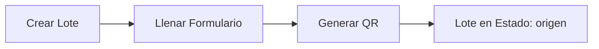
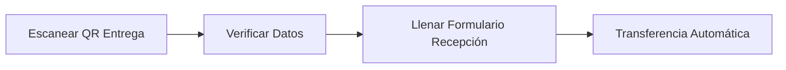
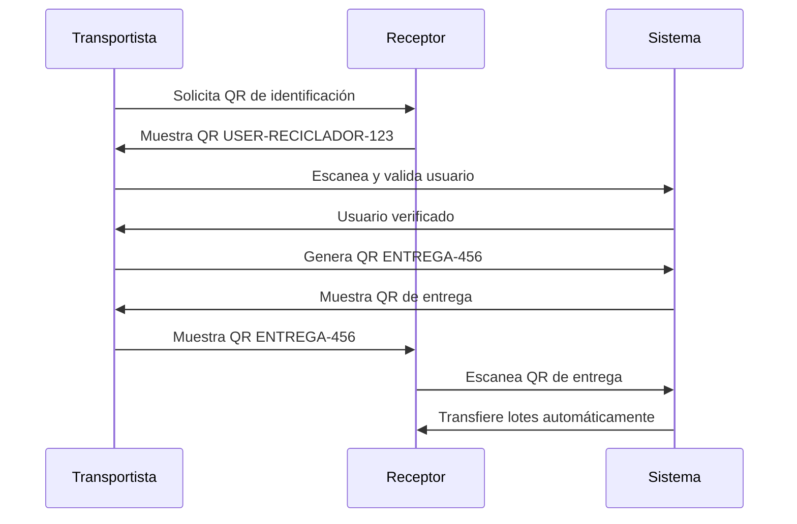

# Sistema de Trazabilidad y Gestión de Lotes - BioWay México

## Índice
1. [Introducción](#introducción)
2. [Arquitectura del Sistema](#arquitectura-del-sistema)
3. [Modelo de Datos Unificado](#modelo-de-datos-unificado)
4. [Flujos de Usuario](#flujos-de-usuario)
5. [Sistema de Identificación por QR](#sistema-de-identificación-por-qr)
6. [Implementación Técnica](#implementación-técnica)
7. [Correcciones y Mejoras Realizadas](#correcciones-y-mejoras-realizadas)
8. [Guía de Mantenimiento](#guía-de-mantenimiento)

## Introducción

El sistema de trazabilidad de BioWay México es una aplicación Flutter que permite el seguimiento completo de materiales reciclables a través de toda la cadena de suministro. El sistema utiliza códigos QR para la identificación mutua de usuarios y el seguimiento de lotes, garantizando la trazabilidad completa desde el origen hasta la transformación final.

### Características Principales
- **Trazabilidad completa**: Seguimiento de materiales desde origen hasta transformación
- **Identificación por QR**: Sistema de identificación mutua entre usuarios
- **Modelo unificado**: Un único ID de lote que persiste a través de todo el proceso
- **Transferencias automáticas**: El escaneo del QR transfiere automáticamente el lote
- **Inmutabilidad**: Los datos históricos nunca se modifican, solo se agregan nuevos

## Arquitectura del Sistema

### Estructura de Firebase

```
lotes/
└── {loteId}/                          # ID único generado automáticamente
    ├── datos_generales/
    │   └── info                       # Información general del lote
    │       ├── id                     # ID del lote
    │       ├── fecha_creacion         # Timestamp de creación
    │       ├── creado_por             # UID del usuario origen
    │       ├── proceso_actual         # "origen" | "transporte" | "reciclador" | etc.
    │       ├── historial_procesos     # ["origen", "transporte", "reciclador"]
    │       ├── qr_code               # Código QR único: "LOTE-{tipo}-{id}"
    │       ├── material_tipo         # Tipo de polímero
    │       ├── material_presentacion # Forma del material
    │       ├── material_fuente       # Origen del material
    │       └── peso                  # Peso actual del lote
    │
    ├── origen/                       # Datos del proceso origen
    │   └── data                      # Todos los datos del formulario origen
    │
    ├── transporte/                   # Datos del proceso transporte
    │   └── data                      # Todos los datos del formulario transporte
    │
    └── reciclador/                   # Datos del proceso reciclador
        └── data                      # Todos los datos del formulario reciclador
```

### Tipos de Usuario y Folios

- **A0000001**: Centro de Acopio (Origen)
- **P0000001**: Planta de Separación (Origen)
- **R0000001**: Reciclador
- **T0000001**: Transformador
- **V0000001**: Transporte
- **L0000001**: Laboratorio

## Modelo de Datos Unificado

### LoteUnificadoModel

El modelo central del sistema que representa un lote a través de toda su vida útil:

```dart
class LoteUnificadoModel {
  final String id;                      // ID único inmutable
  final DatosGeneralesLote datosGenerales;
  final ProcesoOrigenData? origen;
  final ProcesoTransporteData? transporte;
  final ProcesoRecicladorData? reciclador;
  final ProcesoLaboratorioData? laboratorio;
  final ProcesoTransformadorData? transformador;
}
```

### Características del Modelo

1. **ID Único**: Cada lote tiene un ID que nunca cambia
2. **Datos Inmutables**: Los datos de cada proceso se preservan
3. **Trazabilidad Completa**: Acceso a toda la historia del lote
4. **Peso Dinámico**: El peso se actualiza según el último proceso

## Flujos de Usuario

### 1. Flujo de Origen (Centro de Acopio/Planta de Separación)



**Proceso:**
1. Usuario origen crea un nuevo lote
2. Llena formulario con datos del material
3. Sistema genera QR automáticamente: `LOTE-ORIGEN-{id}`
4. Lote queda disponible para ser recogido

### 2. Flujo del Transportista

#### Recogida de Material


#### Entrega de Material (Flujo Mejorado)


**Mejoras Implementadas:**
- Reducción de 3 a 2 pasos
- Navegación automática al QR tras generación
- No requiere clic adicional para mostrar QR

### 3. Flujo del Receptor (Reciclador/Laboratorio/Transformador)



**Características:**
- Datos del transportista pre-cargados automáticamente
- Campos de identificación en modo solo lectura
- Transferencia automática al completar formulario

## Sistema de Identificación por QR

### Tipos de Códigos QR

1. **QR de Usuario**: `USER-{tipo}-{userId}`
   - Identifica únicamente al usuario
   - Usado para identificación mutua

2. **QR de Lote**: `LOTE-{tipo}-{loteId}`
   - Identifica un lote específico
   - Contiene toda la información del lote

3. **QR de Carga**: `CARGA-{cargaId}`
   - Agrupa múltiples lotes para transporte
   - Usado internamente por transportistas

4. **QR de Entrega**: `ENTREGA-{entregaId}`
   - Código temporal para transferencia
   - Válido por 15 minutos
   - Contiene información de la entrega

### Flujo de Identificación Mutua



## Implementación Técnica

### Servicios Principales

#### 1. LoteUnificadoService
Maneja todas las operaciones relacionadas con el modelo unificado de lotes.

```dart
class LoteUnificadoService {
  // Crear lote desde origen
  Future<String> crearLoteDesdeOrigen({
    required String tipoMaterial,
    required double pesoInicial,
    required String fuente,
    // ... más parámetros
  });

  // Transferir lote entre procesos
  Future<void> transferirLote({
    required String loteId,
    required String procesoDestino,
    required Map<String, dynamic> datosIniciales,
  });

  // Obtener lote completo
  Future<LoteUnificadoModel?> obtenerLotePorId(String loteId);
}
```

#### 2. CargaTransporteService
Gestiona las cargas y entregas del transportista.

```dart
class CargaTransporteService {
  // Crear carga con lotes escaneados
  Future<String> crearCarga({
    required List<String> lotesIds,
    required String transportistaFolio,
    // ... más parámetros
  });

  // Crear entrega para receptor
  Future<String> crearEntrega({
    required List<String> lotesIds,
    required String destinatarioId,
    required double pesoTotalEntregado,
    // ... más parámetros
  });
}
```

### Pantallas Clave

#### TransporteEntregaPasosScreen
Gestiona el flujo de entrega del transportista con los pasos mejorados.

**Cambios Implementados:**
```dart
// Antes: 3 pasos con navegación manual
// Ahora: 2 pasos con navegación automática

// Al generar QR de entrega, navega automáticamente
Navigator.pushReplacement(
  context,
  MaterialPageRoute(
    builder: (context) => TransporteQREntregaScreen(
      lotesSeleccionados: _lotesCompletos,
      datosReceptor: _datosReceptor,
    ),
  ),
);
```

#### TransporteQREntregaScreen
Muestra el QR de entrega con toda la información necesaria.

**Mejoras:**
- Generación automática del QR al iniciar
- Timer de validez de 15 minutos
- Información completa del envío
- Logs de depuración para troubleshooting

### Formularios de Recepción

Todos los formularios ahora incluyen:

1. **Información Pre-cargada**
   ```dart
   if (widget.datosReceptor != null) {
     _idDestinoController.text = widget.datosReceptor!['folio'];
     _destinatarioInfo = widget.datosReceptor;
   }
   ```

2. **Campos de Solo Lectura**
   ```dart
   StandardTextField(
     controller: _idDestinoController,
     label: 'Folio del Destinatario',
     readOnly: true, // Campo no editable
   )
   ```

3. **Indicador Visual**
   - Mensaje informativo indicando identificación por QR
   - Información del usuario mostrada automáticamente

## Correcciones y Mejoras Realizadas

### 1. Navegación de Rutas
**Problema:** Faltaban parámetros requeridos en las rutas de navegación.
**Solución:** 
```dart
// main.dart
'/reciclador_formulario_recepcion': (context) {
  final args = ModalRoute.of(context)?.settings.arguments as Map<String, dynamic>?;
  return RecicladorFormularioRecepcion(
    lotes: args?['lotes'] ?? [],
    datosEntrega: args?['datosEntrega'] ?? {},
  );
},
```

### 2. Método uploadBase64Image
**Problema:** Método no existía en FirebaseStorageService.
**Solución:** Implementación completa del método:
```dart
Future<String?> uploadBase64Image(String base64String, String fileName) async {
  try {
    String cleanBase64 = base64String;
    if (base64String.contains(',')) {
      cleanBase64 = base64String.split(',')[1];
    }
    final bytes = base64.decode(cleanBase64);
    final fullPath = 'firmas/$fileName.png';
    final ref = _storage.ref().child(fullPath);
    final uploadTask = await ref.putData(bytes);
    final downloadUrl = await uploadTask.ref.getDownloadURL();
    return downloadUrl;
  } catch (e) {
    print('ERROR al subir imagen base64: $e');
    return null;
  }
}
```

### 3. Propiedad torchState
**Problema:** API deprecada en mobile_scanner v7.
**Solución:** Usar `torchEnabled` en lugar de `torchState`.

### 4. Datos Hardcodeados en QR
**Problema:** Información del receptor y QR de entrega estaban hardcodeados.
**Solución:** 
- Integración con EcoceProfileService para datos reales
- Carga completa de lotes con LoteUnificadoService
- Generación dinámica de QR con datos reales

### 5. Flujo de 3 Pasos Redundante
**Problema:** El paso 3 requería clic adicional innecesario.
**Solución:** 
- Reducción a 2 pasos
- Navegación automática al generar QR
- Mejor experiencia de usuario

### 6. Campos de Búsqueda Manual
**Problema:** Se pedía buscar usuarios ya identificados por QR.
**Solución:** 
- Campos automáticamente llenados
- Modo solo lectura para campos identificados
- Indicador visual de identificación por QR

## Guía de Mantenimiento

### Agregar Nuevo Tipo de Usuario

1. **Actualizar el modelo de datos**
   ```dart
   // En LoteUnificadoModel
   final ProcesoNuevoTipoData? nuevoTipo;
   ```

2. **Crear la estructura en Firebase**
   ```
   lotes/{loteId}/nuevo_tipo/data
   ```

3. **Implementar el servicio de transferencia**
   ```dart
   // En LoteUnificadoService
   case 'nuevo_tipo':
     await _transferirANuevoTipo(loteId, datosIniciales);
   ```

4. **Crear las pantallas necesarias**
   - Formulario de recepción
   - Pantalla de gestión
   - Integración con navegación

### Debugging Common Issues

1. **QR no se genera**
   - Verificar logs en consola
   - Confirmar que `_qrData` no es null
   - Revisar permisos de Firebase

2. **Transferencia falla**
   - Verificar que el lote existe
   - Confirmar proceso_actual correcto
   - Revisar permisos del usuario

3. **Datos no se muestran**
   - Verificar estructura de datos en Firebase
   - Confirmar mapeo correcto en modelos
   - Revisar navegación con argumentos

### Mejores Prácticas

1. **Siempre usar el modelo unificado**
   - No crear modelos separados por proceso
   - Mantener inmutabilidad de datos

2. **Validar datos antes de transferir**
   - Verificar que el usuario tiene permisos
   - Confirmar que el lote está en el estado correcto

3. **Mantener trazabilidad**
   - Nunca eliminar datos históricos
   - Siempre agregar a historial_procesos

4. **Usar transacciones para operaciones críticas**
   - Transferencias de lotes
   - Actualizaciones de estado

## Conclusión

El sistema de trazabilidad implementado proporciona:
- **Trazabilidad completa** de materiales reciclables
- **Identificación segura** mediante códigos QR
- **Transferencias automáticas** que garantizan integridad
- **Experiencia de usuario optimizada** con flujos simplificados
- **Datos inmutables** que preservan la historia completa

El sistema está diseñado para ser escalable, mantenible y proporcionar valor real a todos los usuarios de la cadena de suministro de reciclaje.